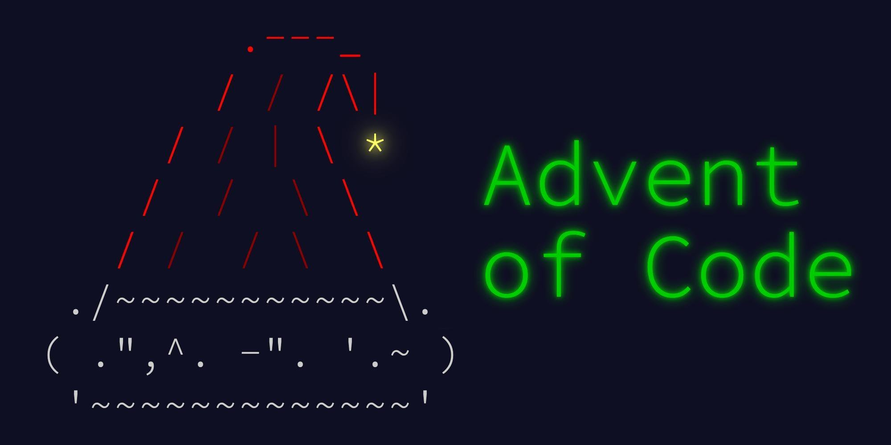

Every year since 2015, <a href="https://adventofcode.com/" target="_blank" rel="noopener noreferrer">Advent of Code</a> happens. Each day from December 1st through December 25th, there's a new 2 part puzzle to solve.

On a typical year, I get to about day 4 then life gets in the way. When I finally remember there's more puzzles to do, it's almost time for the next year of puzzles. This year was pretty different in many ways, and I found myself with lots of free time. I acknowledge that not everyone might find this type of thing fun and that's ok, but this type of activity was perfect for me in my quarantine boredom. Here's my top 5 takeways from doing the 2020 edition of Advent of Code.

#### 1. Think through how you would solve the puzzle in real life before writing code.
I found that sitting down with a piece of paper manually going through the puzzle sample input and seeing what had to be done to match the desired soltuion to be incredibly helpful. It's very tempting to jump straight to code, but I discovered when taking that route I'd often misunderstand a part of the instructions and go down the wrong path. Really thinking through the solution by writing down the steps in plain English and then in code proved to be the most successful method for me.

#### 2. Puzzle input can be different between the sample and the full input.
Each day the puzzle provides you with sample input (sometimes a few sample inputs) with the answer to help you to get to the solution. There were a few days that left me scratching my head as to why the smaller sample input worked while the full input didn't. For the most part the sample input was pretty close to the full input, but these tiny differences could make or break my final solution. If you have outstanding questions in regards to the requirements, take a quick peek at the full input to see how it compares to the sample input and be sure you're taking everything into account. One day I spent hours assuming the input was a square when in reality it was a rectangle.

#### 3. Ask for help.
The overall theme seems to be that the puzzles get harder as the days progress. The great part about these puzzles in my opinion is that they're focused on solving a problem in a programming language agnostic way. There's also a large community of folks who are putting their solutions up on Github, doing live streams on Twitch, or posting videos on YouTube. If you get stuck, there's no shame in taking a look at those to get ideas on how to continue or talking to someone else you know who's also doing Advent of Code regardless of what programming language they're using.

#### 4. There's often multiple ways to solve the same problem.
I often found myself solving a puzzle and then looking at Github to see how others solved it. I learned a lot doing this too, since sometimes others solved the puzzle in a way that I would have never imagined. 

#### 5. Sometimes you need to know a random math theorem to solve the problem.
Day 13 part 2 was giving me some serious trouble. After hours of trying to get it to run, I finally gave up and took a look at someone else's solution. Turned out I needed to know some random math theorem in order to get this working. Not all of us are mathmeticians, so if you run into this don't get down on yourself. It's a great opportunity to learn something new.

#### Closing
In the year 2020, I set out to learn more about traditional computer science data structures and algorithims. Advent of code was a great way to take what I learned throughout the year while having some fun solving silly puzzles on the internet. It can be a tad stressful since there's a new puzzle each day, but don't let that get you down. It's ok to take a break and go back to those puzzles later. As of the time writing this, I have nearly completed all challenges and have already learned a lot. Check out my progress <a href="https://github.com/deeheber/advent-of-code/tree/master/2020" target="_blank" rel="noopener noreferrer">here on Github</a>. If you enjoy programming puzzles and want to learn something new while having fun, I encourage you to check out Advent of Code.