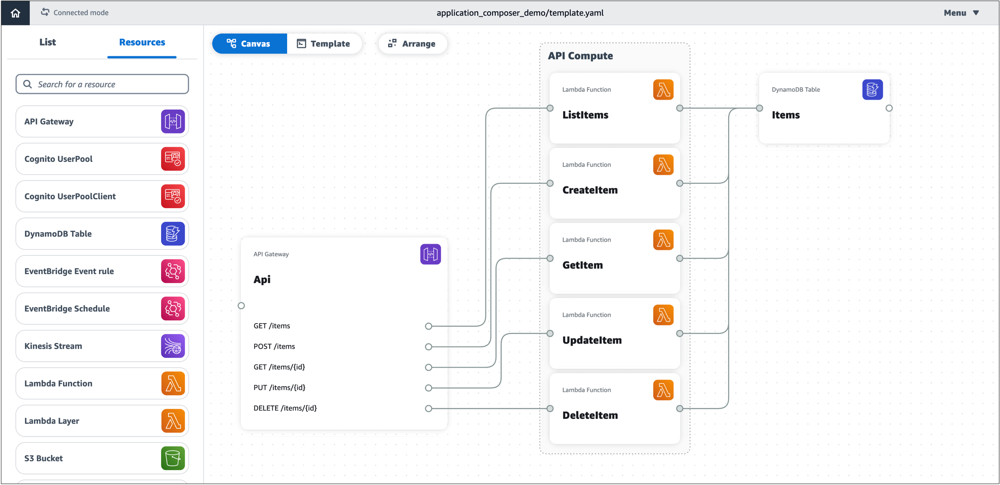
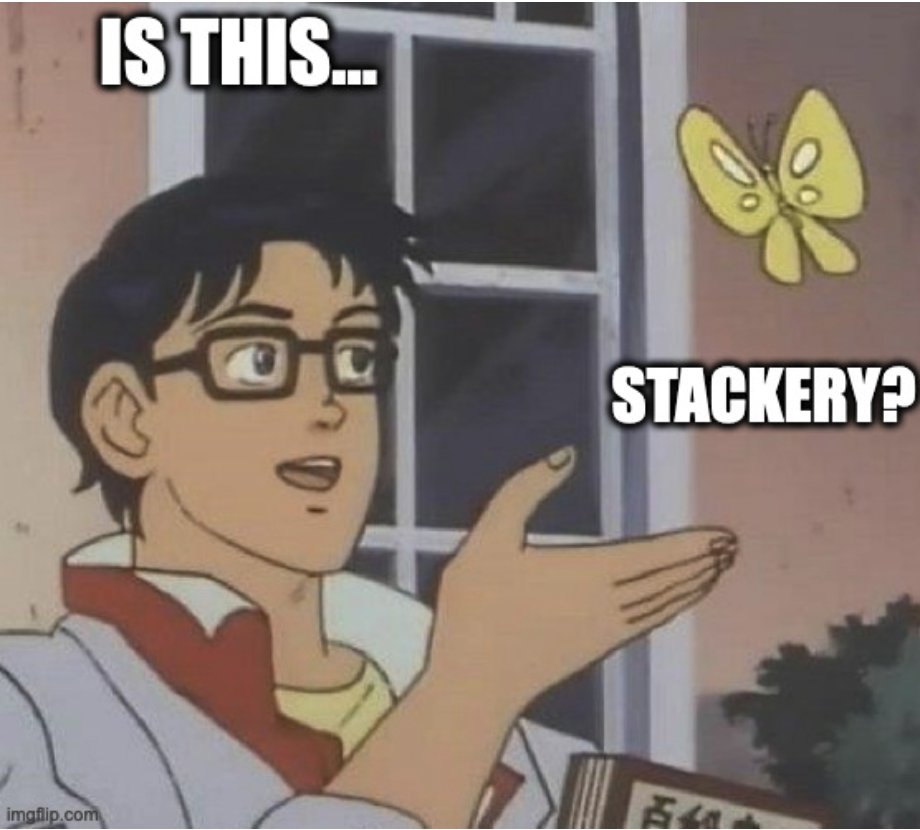

At re:Invent 2022, Werner Vogels announced the preview of <a href="https://aws.amazon.com/application-composer/" target="_blank" rel="noopener noreferrer">AWS Application Composer</a>.

I don't want to write an overview or "getting started" guide, because you can read <a href="https://dev.to/aws-builders/overview-of-aws-application-composer-3j34" target="\_blank" rel="noopener noreferrer">fantastic ones from people in the community</a>. The focus of this post will be an overview of the problems that I see this service solving and what I'd want for the future.

## The Problem

A promise of serverless is being able focus on business logic instead of infrastructure. While I agree with this goal, I don't think it has been fully achieved yet in practice.

Unless you're someone who has a background in operations or cloud, it can be difficult to get started. Once you get started, it can be challenging to move fast...let alone move fast with a team.

A best practice is to utilize infrastructure as code (IaC) to manage and provision cloud resources, because this allows you to have a written/deployable representation of your resources that can be shared in version control with a team. This is wonderful, but if you don't know anything about the resources you're deploying it can be difficult to find a starting point when authoring these files.

Not only is writing the IaC for individual resources challenging, so is figuring out how to connect multiple resources together for a real world application. Things like IAM policies, event triggers for resources such as Lambda, and being able to add environment variables to resources that reference other resources in your stack come to mind.

## The Solution (so far)

Since the beginning of my cloud/serverless journey, there has always been a high demand for a visual way to drag/drop resources that generate deployable IaC. I've seen individuals in the community and companies attempt to build a solution, but none have resulted in widespread adoption.

This problem space is what drew me to work as a software engineer at Stackery. AWS's acquisition of Stackery is what began the journey to what would result in AWS Application Composer. I left the company shortly before the acquisition; however, I still believe strongly in the mission.

> Credit: <a href="https://twitter.com/annaspies" target="_blank" rel="noopener noreferrer">Anna Spysz</a>

## Features I'd like to see post GA

Much like the aspiration of being able to focus on business logic instead of infrastructure, I'd love to see a future where we don't have to write **any** IaC. This way, we can focus on architecture instead of resource configuration. It also has the potential to enable non-engineering participation in application building. While we're far away from that goal, I think we're getting closer with AWS Application Composer.

A popular criticism of AWS Application Composer has been that it outputs <a href="https://aws.amazon.com/serverless/sam/" target="_blank" rel="noopener noreferrer">AWS SAM</a> and not `${preferred IaC}`. While those are valid requests (Terraform support would be **awesome** for my day job), I think the folks focusing on this (many of whom I respect) are missing the bigger picture.

With that, here's a bulleted list of other things I'd like to see in the future:

- A way to use this outside of the AWS console - Some organizations restrict access to the console for regulatory reasons. Something like an IDE extension might help.
- Amazon VPC resource - RDS requires a VPC.
- AWS AppSync resource - GraphQL is amazing for mobile applications (and other use cases).
- AWS Step Function resource integration into Workflow Studio - Allows for easier usage of a service that is often recommended by AWS employees to use in serverless applications.
- One button push deployment from the console - It's great as is with
  <a href="https://docs.aws.amazon.com/serverless-application-model/latest/developerguide/accelerate.html" target="_blank" rel="noopener noreferrer"> AWS SAM accelerate</a>...but I'd love to see it be easier.

If you have any suggestions, I recommend using the "submit feedback" link in the console with details as to why you want x feature. The team wants to hear your feedback and is actively using it to improve the product.

## Closing thoughts

I think AWS's acquisition of Stackery makes a lot of sense and hopefully being directly embedded as a service within AWS will make it even better.

This team deeply cares about developer experience and reducing the friction that exists within AWS serverless. They are some of the most brilliant and humble folks I've ever had the pleasure to call coworkers. The team members whom I've interacted with who aren't former coworkers have been nothing but kind and helpful.

I hope that the dysfunction that sometimes exists with individual egos in big name corporations does not mess up the larger vision that started at Stackery. For now, I have faith that AWS can give the team the resources that they need to scale out this vision further. I very much look forward to what the future holds.

If you haven't yet, I encourage you to give it a try and provide feedback. It's still in preview and far from finished, but I think you'll be pleasantly surprised.
