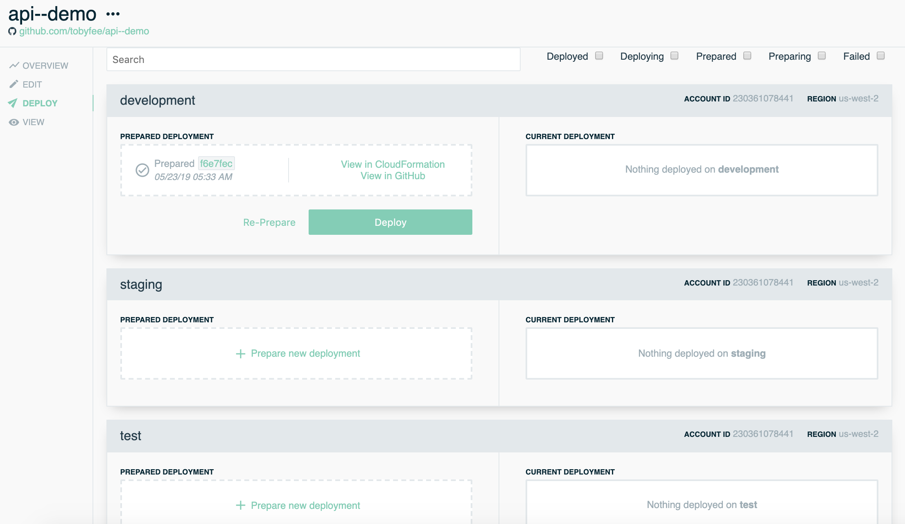

As an individual coming from a customer support background that knows the value of being on the front lines, I am ecstatic that Stackery focuses on the customer across all teams. Moreover, I’m excited by the impact of having the front line perspective ingrained in the product we build. After all, the customers are the reason why we work so hard at what we do. In this post, I’m going to highlight some of the major benefits that I’ve noticed as a software engineer working in a periodic customer service rotation capacity. Here at Stackery, we call this the “Support Hero” role.

## 1. Better time management

The flow of work is very different when working on engineering tasks vs customer service tasks. The first thing that I noticed when working the customer support rotation was that I had to make sure I was in the office and available to receive customer inquiries from 9am-5pm every day that week. If I had to step out for a meeting or break, I had to keep an eye on our support channels and/or ask a teammate to cover for me while away.
During my weeks of software engineering, I have a bit more freedom and flexibility when it comes to starting and ending my work day and can pretty much get up and take a break without needing to think about coverage.
Beyond making sure I’m available if customers have questions, I also find myself needing to be flexible in order to balance having multiple conversations with different folks, oftentimes simultaneously. Since all inquiries are unique, they each require a different level of attention, care, and focus.

## 2. Clearer communication with others

A lot of the times companies have their own internal jargon of what they call things. This internal jargon often doesn’t map directly to what external customers are calling things. It’s easy to get into a habit of using a specific set of terms and phrases so much that you just assume everyone speaks the same way. When chatting with customers, I find that Stackery is not the exception to this and when I started my rotation, I often found myself asking for more clarification when a customer submitted an inquiry— I had to be certain we were on the same page.
The more I speak with customers, the better I get at being able to intuitively read what they’re looking to do. This is a better way because the conversation can be more natural instead of a back-and-forth sequence of asking questions.
A lot of times, I find answering the customer’s question to be quicker than that initial discovery of what they’re looking to do. It’s important to not jump ahead and skip that very important step at the beginning of the conversation.

## 3. A different perspective

I think many people in the modern workforce have worked at a company where the software engineers sit off in their own world and don’t get to hear the direct feedback from customers about the product they’re building. When creating a product and staring at the user interface for 40+ hours a week, it is easy to gain some heavy biases around how folks use the product and about what customers want.
Through working in customer support, I’ve discovered a lot of bugs and things that seem intuitive to me, but in reality, are confusing to the bulk of the population. Being able to hear these concerns directly from a customer can help me attach a face and story to how this affects their daily work and gives me a higher urgency to ensure that reported issues are handled in a timely manner.

## 4. Increased product knowledge

An enterprise sized application is huge and has many different moving parts. It is impossible to fully master all of it. This is especially true if you’re a software engineer working on a product. In my personal experience, I’ve found myself to be an expert on the parts of the application that I had a key part in developing while I have significantly less knowledge about the other parts.
Working in customer service, customers will ask questions related to every part of the application. I love this because it gives me more incentive to explore the other parts of the application that I might otherwise be unfamiliar with.

## 5. A better product. Period.

I want to give one example of how our customer support can improve the product. One of Stackery’s super powers is bundling and managing the configuration and environment variables so that all the settings you need to run in “staging” or “production” are in one place. We on the team knew that this feature helped users take the same set of functions and resources and deploy them in different environments.
Our users, however, were more confused by these tools than empowered. We used that feedback to build something great.

Every week the “Support Hero” would hear from users confused by what these “environment” settings even did. We took their responses and spent some time redesigning the interface, and along with other feedback we designed a new “deploy” interface that clearly showed the environments you’d created, and let you choose to deploy your app to seperate environments in sequence.

> our updated interface made the tool we’d already built a lot easier for our users to understand and use

This feedback, and the improvements, wouldn’t have happened if we didn’t have engineers doing support. The users weren’t asking for more environment support, it wasn’t a feature they were really aware of, so they weren’t going to tell Sales they wanted something they hadn’t heard of. And if all we’d looked at was user behavior, we probably would have assumed “people just don’t want to manage the same app in separate environments.” It was only by dealing with users directly, realizing that a tool we already had could help users if the User Interface (UI) was better.

With this process in place, and the product improvements driven by support hero experiences, we’ve seen our weekly active Stackery users triple. I beleive that a number of factors have influenced this including our the launch of <a href="https://www.stackery.io/blog/how-to-serverless-locally/" target="_blank" rel="noopener noreferrer">Stackery local invoke</a> but it also seems clear to me that the use of Stackery is growing because we are able to help trial users and inquiring minds more efficiently.

Acheive great things
This type of process may not be appropriate for all organizations, but I thought I’d share a little bit about how our “Support Hero” philosophy has strengthened the Stackery product. I also believe that this has strengthened the Stackery software engineers on an individual level. I see my coworkers inspired to reflect on how our company is engaging with customers. It to makes the Stackery product and service better.

Want to benefit from a direct line of communication with Stackery’s serverless engineers? There are a variety of ways you can ask us questions, but one of the most fun is to join our team’s weekly livestream on Wednesdays at 10 AM PDT. Sometimes there are topics and guest hosts and sometimes we leave it as an open demo. Either way, it’s a great chance to get to know Team Stackery and ask us anything!

> Note: This post was originally published on https://www.stackery.io/
