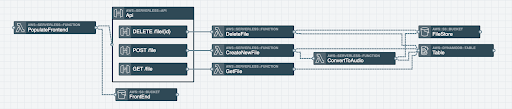
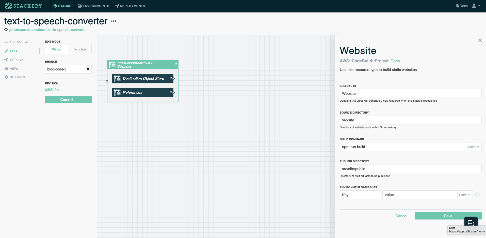
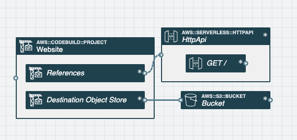
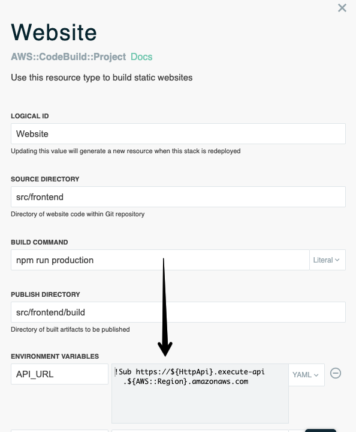
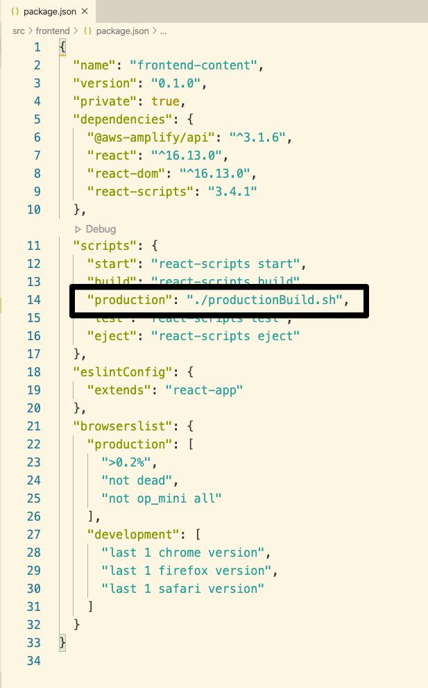
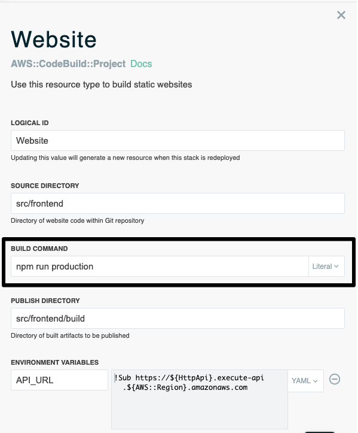
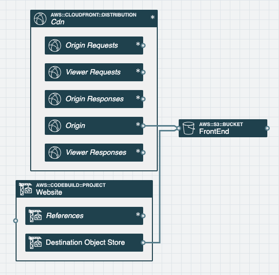

The trend of the frontend and backend coming closer together is continuing and even has a name now...the <a href="https://jamstack.org/" target="_blank" rel="noopener noreferrer">Jam stack</a>.

[Last year](https://danielleheberling.xyz/blog/deploy-frontend/), I discussed my excitment about the backend and frontend slowly merging closer together and did a walk through on how to deploy a JavaScript based frontend to an S3 bucket with website hosting enabled.

Building and deploying websites still continues to be a very common use case with folks using AWS, but I personally wanted a more "push button" solution that would also allow me to connect my Stackery backend resources easily. So I've decided to iterate on what we built the last time to make it better.

### What We Built Last Time
<a href="https://www.danielleheberling.xyz/blog/text-to-speech/" target="_blank" rel="noopener noreferrer">Previously</a>, I wrote an application that translates written text to speech. I was getting tired of having to recall the different API endpoints to hit and wanted a nice UI to better manage these files...so I got to work on building a frontend.

Then I got tired of manually building and uploading those files to S3 for website hosting, so I wrote a Lambda function to do this for me. Here's what the final architecture looked like



That is all fine and still works, but keeping up with latest Serverless trends I recognize that writing code in a Lambda function can cause potential unwanted technical debt. What if there was some service that I could just input specific things like:
  - source code location
  - build command
  - built files location
  - location (an S3 Bucket) to upload the built files

Lucky for us, there's AWS CodeBuild!

So I embarked on the journey of replacing my `PopulateFrontend` Lambda function with a CodeBuild Project.

### The Easy Push Button Way of Doing this
Stackery released the <a href="https://docs.stackery.io/docs/api/nodes/Website/" target="_blank" rel="noopener noreferrer">Website Resource</a>. Check it out...it's just a matter of dragging and dropping the resource into your stack and providing a few settings (Source Directory, Build Command, and Publish Directory).



We have a more detailed tutorial <a href="https://docs.stackery.io/docs/tutorials/react-spa-tutorial/" target="_blank" rel="noopener noreferrer">here</a>.

### Connecting my Frontend to a Backend API
Once your S3 Bucket and Website are on the canvas, add an API too (both HTTP API and original API Gateway work).



After you connect the API to the `References` facet under the `Website`, you'll then see that the `API_URL` environment variable is available to the CodeBuild Project.



I personally decided to write a minimal shell script that writes the `API_URL` environment varaible to a file that my frontend code later references. Here's a snippet.

```
#!/bin/sh

# Inject API into config file
echo "export default {
  backendAPI: '$API_URL'
};" > src/config.js

echo "Config file written to src/config.js"

# Build the site
npm run build
```

I added an npm script to my `package.json` that executes this script, titled it "production", and updated my `Website` `Build Command` to be `npm run production`. All this script does is run the snippet above.





### Speeding up the Delivery with a CDN (Optional)
If you want to speed up the delevery of your website, I'd suggest adding a CDN in front of your S3 bucket using Amazon CloudFront. Connect your S3 Bucket to the CDN Origin like this.



### The CodeBuild Job
The rest of this post is going to be a technical deep dive under the hood for those who are interested.

The CodeBuild job does the following:
1. Installs dependencies  (in my case NodeJS  and NPM)
2. Copies my source code into the build job container
3. Executes my build command
4. Copies the built files into an S3 Bucket

All of the necessary variables are set via the Stackery Website resource settings, but you can also directly alter the template if you prefer.

Here's what the CodeBuild job template code looks like for my text to speech converter app:

```
Website:
  Type: AWS::CodeBuild::Project
  Metadata:
    StackeryType: website
  DependsOn: WebsiteRole
  Properties:
    Name: !Sub ${AWS::StackName}-Website
    Artifacts:
      Type: NO_ARTIFACTS
    Environment:
      ComputeType: BUILD_GENERAL1_SMALL
      Image: aws/codebuild/amazonlinux2-x86_64-standard:3.0
      Type: LINUX_CONTAINER
      EnvironmentVariables:
        - Name: API_URL
          Value: !Sub https://${HttpApi}.execute-api.${AWS::Region}.amazonaws.com
    ServiceRole: !GetAtt WebsiteRole.Arn
    Source:
      Type: NO_SOURCE
      BuildSpec: !Sub
        - |-
          version: 0.2
          phases:
            install:
              runtime-versions:
                nodejs: latest
                python: latest
                ruby: latest
              commands:
                - |
                  _SOURCE_LOCATION=${SourceLocation}
                  if [ s3 != "${!_SOURCE_LOCATION%%:*}" ]; then
                    git clone ${SourceLocation} repo
                    cd repo
                    git checkout ${SourceVersion}
                  else
                    aws s3 cp ${SourceLocation} repo.tgz
                    tar --strip-components 1 -xvvzf repo.tgz
                  fi
                - cd ${SourceDirectory}
            pre_build:
              commands:
                - |
                  if [ ! -f yarn.lock -a -f package.json ]; then
                    npm install --production
                  elif [ -f yarn.lock -a -f package.json ]; then
                    yarn install --production
                  elif [ -f requirements.txt ]; then
                    pip install -r requirements.txt
                  elif [ -f Gemfile ]; then
                    bundle install
                  fi
            build:
              commands:
                - ${BuildCommand}
            post_build:
              commands:
                - |
                  _SOURCE_LOCATION=${SourceLocation}
                  if [ s3 != "${!_SOURCE_LOCATION%%:*}" ]; then
                    cd "${!CODEBUILD_SRC_DIR}/repo"
                  else
                    cd ${!CODEBUILD_SRC_DIR}
                  fi
                - aws s3 sync '${PublishDirectory}' 's3://${DestinationBucketName}' --acl public-read --cache-control 'max-age=0, must-revalidate, public' --no-progress --delete
        - PublishDirectory: src/frontend/build
          BuildCommand: npm run production
          SourceDirectory: src/frontend
          DestinationBucketName: !Ref FrontEnd
    Tags:
      - Key: Stackery Project Type
        Value: Website Builder
```

### Orchestrating the CodeBuild Job
Now that the CodeBuild job is setup, we know how we're going to build the site and publish it to an S3 Bucket. The remaining question is how can we trigger the CodeBuild job to start when the CloudFormation stack is deployed?

My answer to that question was to use a <a href="https://docs.aws.amazon.com/AWSCloudFormation/latest/UserGuide/template-custom-resources.html" target="_blank" rel="noopener noreferrer">Custom Resource</a>. The template for it looks like this

```
WebsiteBuildTrigger:
  Type: Custom::StackeryWebsiteBuildTrigger
  DependsOn: WebsiteEvents
  Properties:
    ServiceToken: !Sub arn:aws:lambda:${AWS::Region}:${AWS::AccountId}:function:stackery-agent-commander
    Type: website
    ProjectName: !Ref Website
    SourceVersion: !Ref SourceVersion
```

Note the `Type` starts with `Custom::`...this is  how  CloudFormation knows it's a custom resource.

Any time one of the `Properties` changes (in this case the `SourceVersion`), CloudFormation will trigger Lambda function I specify under `ServiceToken`. In this case, it's a Stackery controlled Lambda function in a different CloudFormation stack that has two main jobs:
  1. Trigger the start of the CodeBuild job
  2. Report back to CloudFormation when the CodeBuild job succeeds or fails, so CloudFormation knows how to continue  deploying the stack

Step 1 is handled directly in the Lambda function via <a href="https://docs.aws.amazon.com/cli/latest/reference/codebuild/start-build.html" target="_blank" rel="noopener noreferrer">this command</a>, but how can we enable the CodeBuild job to report back a success or failure to CloudFormation?

My answer is `CloudWatch Events`. This is wired up in the template under the resource named `WebsiteEvents`.

```
WebsiteEvents:
  Type: AWS::Events::Rule
  DependsOn: Website
  Properties:
    EventPattern:
      source:
        - aws.codebuild
      detail-type:
        - CodeBuild Build State Change
      detail:
        build-status:
          - SUCCEEDED
          - FAILED
          - FAULT
          - STOPPPED
          - TIMED_OUT
        project-name:
          - !Ref Website
    Targets:
      - Arn: !Sub arn:aws:lambda:${AWS::Region}:${AWS::AccountId}:function:stackery-agent-commander
        Id: StackeryAgentCommander
```

When the CodeBuild Project for our Website has a build status of SUCCEEDED, FAILED, FAULT, STOPPED, or TIMED_OUT, the configured CloudWatch Event reports this information back to my custom resource function. My custom resource function then sends the appropriate information to CloudFormation. Once CloudFormation gets a pass/fail response, it knows how to conintue with deploying the stack.

### Closing
Check out the entire code repository referenced <a href="https://github.com/deeheber/text-to-speech-converter/tree/blog-post-3" target="_blank" rel="noopener noreferrer">here</a>.

There are definitely many different approaches to build and deploy a JavaScript frontend on AWS. I encourage you to investigate everything that's out there and see what works best for you.

I'm biased, but I recommend checking out Stackery. Not only has the <a href="https://docs.stackery.io/docs/api/nodes/Website/" target="_blank" rel="noopener noreferrer">Website resource</a> been added recently, we've also updated our Developer plan to have more features still at the amazing price of free.
