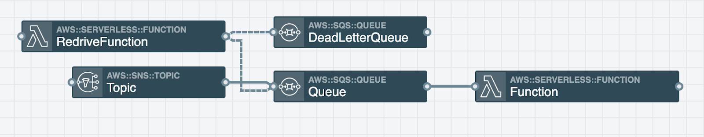

> Photo by Samuel Zeller on Unsplash

A common pattern in serverless architecture is to have a queue before a function. This is great because you can create a second queue for all of the messages that failed in the function execution (or, if we want to put it in terms that don’t sound like we’re aggressively shaming them, we can classify them as having “encountered an error at some point”). This second queue is known as a “dead letter queue” or DLQ for short. If messages arrive in the DLQ, you can analyze what might have caused the error by reviewing any relevant logs, making changes to your stack, and running a redrive function to retry those messages. DLQs are useful for debugging your serverless application because they let you isolate problem-messages to determine why their processing isn’t working.

A redrive function is how we get those failed messages out of the DLQ and back into the original pipeline to retry the operation. I wanted to set up this type of architecture in a new stack using Stackery and decided to take a look around the internet for inspiration on different patterns and ideas on how to go about it. I found lots of information about dead letter queues, but no examples that demo-ed a redrive function to retry those failed messages. This post is meant to serve as a nice example for folks like me who want to do this on AWS and haven’t found many examples.

## The Setup

### Happy Path

Let’s start out with our happy path flow. I’ve set up a stack that consists of an SNS topic > SQS queue > Lambda function. In Stackery it looks something like this:


### Retry Path

In the event that something goes wrong during the function execution, I set up a second queue; this will serve as my DLQ for failed messages to be delivered. I then added a redrive function to allow me to retry those failed messages through the original pipeline. Here’s what that set up looks like:



I added a RedrivePolicy to the original SQS queue to point those failed messages to my DLQ by adding some <a href="https://aws.amazon.com/cloudformation/" target="_blank" rel="noopener noreferrer">Cloudformation</a> in my template.yaml:

```yaml
Queue:
  Type: AWS::SQS::Queue
  Properties:
    QueueName: !Sub ${AWS::StackName}-Queue
    RedrivePolicy:
      deadLetterTargetArn: !GetAtt DeadLetterQueue.Arn
      maxReceiveCount: 3
```

By default, the queue’s message retention period is 4 days. I wanted to give myself some extra time to review the messages in the DLQ, so I upped the MessageRetentionPeriod on my DLQ to the max allowed 14 days like this in my template.yaml. This is the sci-fi beauty of my profession: creating _more time_ is possible! As many before me have discussed on the floor of a dorm room, time is a malleable concept— and at least in software engineering, it has a practical purpose like gaining more days to review DLQ messages. Note that the values are in seconds:

```yaml
DeadLetterQueue:
  Type: AWS::SQS::Queue
  Properties:
    QueueName: !Sub ${AWS::StackName}-DeadLetterQueue
    MessageRetentionPeriod: 1209600
```

## Redrive Function Content

Now that the base architecture is all set up, let’s take a look inside the redrive function. This is how I decided to set mine up, but keep in mind that there are many different ways you can do this:

Here’s the high-level steps of what our retry function needs to do:
Receive messages from the DLQ
If no messages are received exit the function
If there are received messages, loop through each message > send it to the original queue
Delete the message from the DLQ on a successful send
Repeat

Here’s what the code looks like written in nodeJS:

```javascript
const aws = require('aws-sdk');
const sqs = new aws.SQS();

exports.handler = async (event) => {
  // Log the event argument for debugging and for use in local development.
  console.log(JSON.stringify(event, undefined, 2));

  while (true) {
    try {
      // Use long polling to avoid empty message responses
      const receiveParams = {
        QueueUrl: process.env.DLQ_URL,
        MaxNumberOfMessages: 10,
        WaitTimeSeconds: 1,
      };

      // Get messages from the DLQ
      // Continue looping until no more messages are left
      const DLQMessages = await sqs.receiveMessage(receiveParams).promise();

      if (!DLQMessages.Messages || DLQMessages.Messages.length === 0) {
        console.log(`NO MESSAGES FOUND IN ${process.env.DLQ_URL}`);
        // Exit the loop since there aren't any messages left
        break;
      }

      console.log(`RECEIVED ${DLQMessages.Messages.length} MESSAGES`);

      for (const message of DLQMessages.Messages) {
        // Send message to original queue
        const outboundMessage = {
          MessageBody: message.Body,
          QueueUrl: process.env.QUEUE_URL,
        };

        console.log(`SENDING: ${JSON.stringify(outboundMessage, null, 2)}`);
        await sqs.sendMessage(outboundMessage).promise();
        console.log('SEND MESSAGE SUCCEEDED');

        // Delete message from DLQ
        const deleteParams = {
          QueueUrl: process.env.DLQ_URL,
          ReceiptHandle: message.ReceiptHandle,
        };

        console.log(`DELETING: ${JSON.stringify(deleteParams, null, 2)}`);
        await sqs.deleteMessage(deleteParams).promise();
        console.log('DELETE MESSAGE SUCCEEDED');
      }
    } catch (err) {
      console.log(`AN ERROR OCCURRED: ${err.message}`);
      console.log(JSON.stringify(err, null, 2));
      throw err;
    }
  }
};
```

### What to keep in mind when setting up a redrive function.

#### Receive message step

The default MaxNumberOfMessages to return is 1, so you’ll most likely want to up that number depending on your use case. I just went to the max allowed which is 10.
If you hypothetically have 10 messages in your DLQ and do receiveMessage on that queue with a MaxNumberOfMessages set to 10, you might possibly not receive all of those messages in a single receiveMessage batch. It’s important to have looping to ensure that you receive all of the messages when they are available.
Enabling long polling can help reduce the cost of SQS by reducing the number of empty responses. I decided to go this route by adding WaitTimeSeconds to my receiveMessage params.

#### Delete message step

Ensure the send message was successful before deleting it. I decided to wrap the entire function in a try, catch...so if there’s an error the function will stop processing.

As you can see, it does require a bit of additional setup, but creating dead letter queues and a redrive function to re-run failed messages can be extremely helpful in your application’s life cycle. You can go to https://github.com/deeheber/redrive to see an example of a simple stack that uses a DLQ and a redrive function in action.

For a solid and succinct description of the benefits of a DLQ (alongside lots of other info about them,) check out the AWS documentation <a href="https://docs.aws.amazon.com/AWSSimpleQueueService/latest/SQSDeveloperGuide/sqs-dead-letter-queues.html#sqs-dead-letter-queues-benefits" target="_blank" rel="noopener noreferrer">here</a>.

**Update December 1, 2021** - AWS has added the ability to redrive your SQS messages in the console. See [here](https://aws.amazon.com/about-aws/whats-new/2021/12/amazon-sqs-dead-letter-queue-management-experience-queues/) for more information.

> Note: This post was originally published on https://www.stackery.io/
