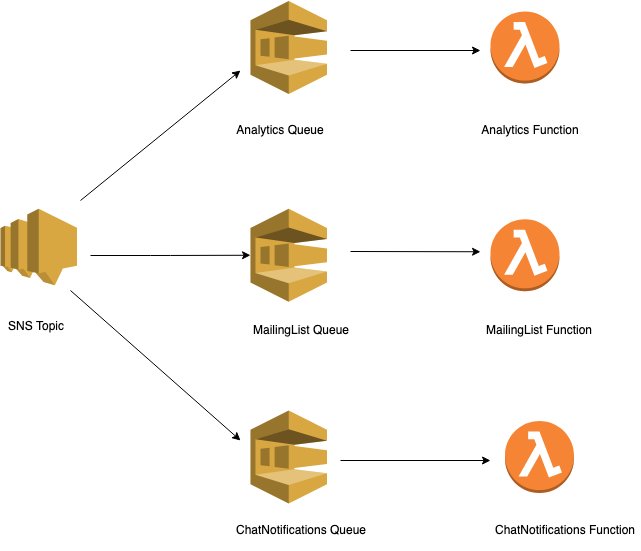

One theme when talking about serverless computing that frequently comes up is that "serverless is event driven." Personally I've found this to be true and am going to share one of my favorite event driven architectures built with AWS in this post.

## Business Scenario
For this post, we're going to use a simplified example application.

In our example application, whenever a user signs up to use our application, we want to perform the following three actions:
1. Count the event in our <a href="https://heap.io/" target="_blank" rel="noopener noreferrer">3rd party analytics service</a>
2. Put them on an email mailing list in our <a href="https://mailchimp.com/" target="_blank" rel="noopener noreferrer">Mailchimp account</a>
3. Send a notification to a <a href="https://slack.com/" target="_blank" rel="noopener noreferrer">Slack</a> channel in our corporate slack

## Implementation
There's many ways someone could approach this issue, but my favorite way is to use a "fan out" or "event fork" approach. Here's how it works.

In our example use case, when the person signs up to use the application, we send a message to <a href="https://aws.amazon.com/sns/" target="_blank" rel="noopener noreferrer">Amazon SNS</a>. That SNS topic then receives that message and sends it to three <a href="https://aws.amazon.com/sqs/" target="_blank" rel="noopener noreferrer">queues</a>, each having a <a href="https://aws.amazon.com/lambda/" target="_blank" rel="noopener noreferrer">function</a> on the other side. Each function contains code that does the heavy lifting for us.

## Message Filtering
In a real life application, you'll most likely have many many events that you want to track and perform actions as a result.

Let's revisit our example and add a new event we want to track - login. For login, we only want to count the event in our 3rd party analytics service and ignore adding them to a mailing list (they're already signed up) and ignore receiving a slack notification (that would be a lot of noise in slack).

We can accomplish this by utilizing <a href="https://docs.aws.amazon.com/sns/latest/dg/sns-message-filtering.html" target="_blank" rel="noopener noreferrer">SNS message filtering</a>.

## Benefits to this Approach
Like any architecture decision, there are always pros and cons. The important thing is to weigh the two together and use what works for you and your team. Here's some benefits I've noticed and why I enjoy using this approach:

1. The events are decoupled from the initial action. For example, we wouldn't want someone to not be able to sign up just because there was an error counting the signup in our analytics.
2. These background reactions to events don't need to be instant since we don't need to provide the user feedback...it's just for our backend office uses, so it is fine to process these events seperate from the general application flow.
3. Let's say you have a CLI tool and a web application...both of those can send messages to this SNS topic.
4. If you decide you no longer want to use Mailchimp as your email list provider, you can delete the corresponding queue/function combo and add a new queue/function to process your replacement mailing list service.

## Additional Things to Keep in Mind
I didn't discuss this in detail here, but it's a good practice to have a "dead letter queue" (DLQ) on each queue setup, so you can retry failed events. You can read more about how to do this in this <a href="https://www.danielleheberling.xyz/blog/dlq-messages/" target="_blank" rel="noopener noreferrer">blog post</a>.

In our example architecture, we focused on SNS -> SQS -> Lambda; however, there are many other ways that you can achieve a "fan out" architecture. For example: <a href="https://aws.amazon.com/eventbridge/" target="_blank" rel="noopener noreferrer">Amazon EventBridge</a> or <a href="https://aws.amazon.com/step-functions/" target="_blank" rel="noopener noreferrer">AWS Step Functions</a>.

Check out this <a href="https://github.com/deeheber/event-fork" target="_blank" rel="noopener noreferrer">GitHub repo</a> for a starter template using <a href="https://aws.amazon.com/serverless/sam/" target="_blank" rel="noopener noreferrer">AWS SAM</a> if you'd like to see how to implement this architecture.
