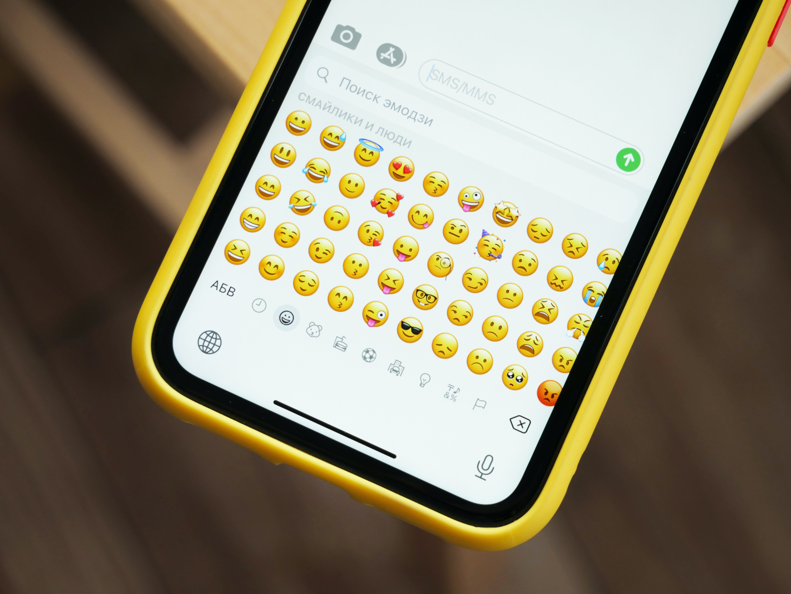
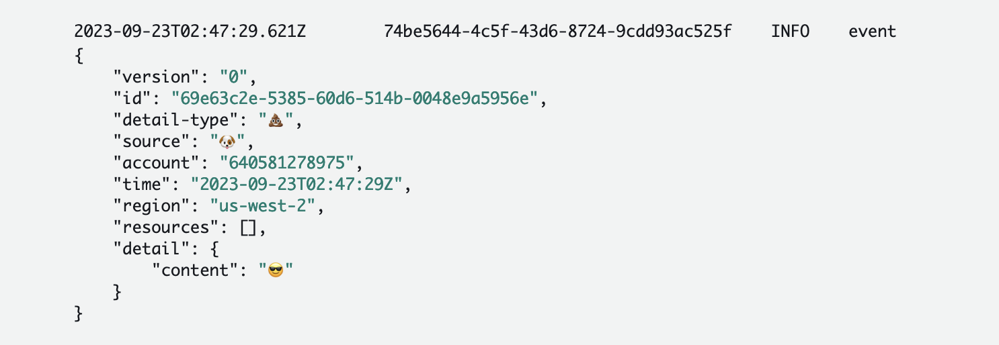

> Photo by <a href="https://unsplash.com/@denic?utm_source=unsplash&utm_medium=referral&utm_content=creditCopyText">Denis Cherkashin</a> on <a href="https://unsplash.com/photos/qIKSsOMIhpM?utm_source=unsplash&utm_medium=referral&utm_content=creditCopyText">Unsplash</a>

## Background

The other day, I was answering some questions a coworker had about EventBridge. He then jokingly said "I wonder if I can use emojis for an event pattern because they are UTF-8."

After that conversation, I couldn't stop thinking about it. So I threw together a quick CDK stack and it works!

## Try it yourself

I've made my quick CDK stack public [on Github](https://github.com/deeheber/eventbridge-emoji). You're welcome to test with mine.

**This stack contains**

- A rule with emojis only in the Event Pattern on the `default` event bus
- A Lambda as the target of the rule that will be invoked and logs the event

### Steps

1. Clone the repo
2. Configure your AWS credentials locally if you have not yet
3. `npm i && npm run cdk deploy` to deploy the stack
4. Put events on the default event bus with either the [CLI](https://awscli.amazonaws.com/v2/documentation/api/latest/reference/events/put-events.html), and AWS SDK, or in the AWS console. The event pattern is `detailType: ['💩']` and `source: ['🐶']`.
5. Check the Lambda's CloudWatch logs to see that it has been invoked

## Closing

You can also update the code to contain other emojis as well. From my testing, I found having multiple emojis in a single event pattern works as well.

Not 100% practical in all cases, but thought I would share these findings pubicly. Now go forth and update your EventBridge event patterns. 🎉
