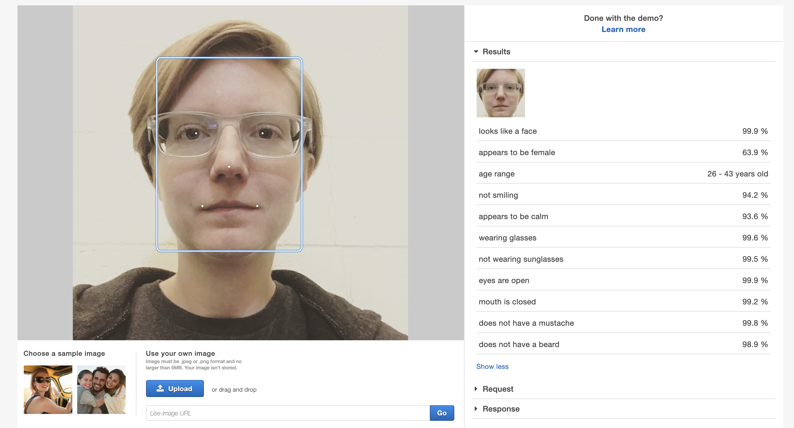
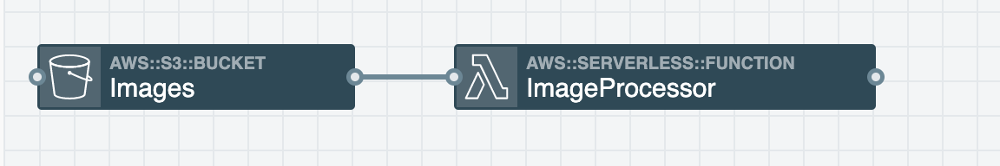
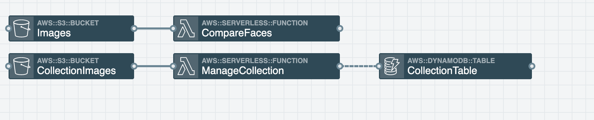

Artificial intelligence (henceforth referred to as AI for the rest of this post) is becoming more and more prominent in our lives whether we realize it or not. This fact both excites and terrifies me as an individual. It is exciting because AI has the major potential to make all of our lives easier. It is terrifying because as a minority on multiple levels, I fear that my unique view and challenges in the world might not be reflected in those learning models if folks who look and act like me are not actively involved in the creation of those models. Furthermore, I’m also afraid for folks who don’t have as much privilege as I do.

So like the serverless developer that I am, I decided to scratch the surface by playing around a bit with the AWS service <a href="https://aws.amazon.com/rekognition/" target="_blank" rel="noopener noreferrer">Rekognition</a>. I wanted to see what I could do with it and also to test it’s accuracy.

## Detect Labels

I began my journey with the detect labels API. To me this was super interesting, because all that I had to do was feed the API an image and the managed AWS service would do all of the heavy lifting and return a list of labels along with the level of confidence in that label. For example it might return something that would suggest “I’m 90% confident there is a dog” in this image.

Stackery and the AWS SDK made this possible for me to build. I set up an S3 Images bucket where uploading an image would trigger my ImageProcessor Lambda function. Then within the ImageProcessor Lambda function, I used the AWS SDK to make calls to Rekognition. For simplicity sake, I decided to just send the results to my Cloudwatch logs. Here’s what that architecture looked like.

If you'd like to see my code for this stack, you can check it out <a href="https://github.com/deeheber/face-match/tree/detectLabels" target="_blank" rel="noopener noreferrer">here</a>.

## Compare Faces

Overall, the images that I uploaded were surprisingly accurate in the results returned, so I decided to go a step further. How about I create an application that when I upload an image of a person, it does a comparison through a collection of images of myself to see if there are any face matches? When I spoke about this idea with a coworker, he suggested I use this as a way to unlock a diary. Hardware on the diary takes a picture of me and then if there is a face match, the diary unlocks. Unsure if I’ll do that exact thing with this, but it was a pretty funny idea.

First, I needed to setup a collection that contained pictures of myself. These pictures are the ones that I will be comparing to, so it’s important to get a nice mix of pictures that are reflective of how I would look on an average day. So I opened up my terminal, installed the <a href="https://docs.aws.amazon.com/cli/latest/userguide/cli-chap-install.html" target="_blank" rel="noopener noreferrer">aws cli</a>, and ran:

`aws rekognition create-collection --collection-id Danielle`

I then set up a CollectionImages S3 bucket in which a put or delete event will trigger my ManageCollection Lambda function.

When I upload an image to the CollectionImages S3 bucket (put), the ManageCollection Lambda function adds the face to the collection via <a href="https://docs.aws.amazon.com/rekognition/latest/dg/API_IndexFaces.html" target="_blank" rel="noopener noreferrer">index faces</a>. Index faces will index all faces in an image, so for this case I only uploaded images that were me alone and set MaxFaces to 1. Upon successful index, I then stored the FaceId and bucket information in a DynamoDB table for later use.

When I delete an image from the CollectionImages S3 bucket, the ManageCollection Lambda function retrieves the FaceId that I stored in DynamoDB when uploading the image and uses that information to call <a href="https://docs.aws.amazon.com/rekognition/latest/dg/API_DeleteFaces.html" target="_blank" rel="noopener noreferrer">delete faces</a>. DeleteFaces removes that face from the collection. I then want to keep my data tidy, so I remove the information related to that deleted image from my DynamoDB table.

Now that my collection is all set, I have pictures to compare to...now let’s get to doing the face comparisons. To do this, I set up an Images S3 bucket. When I upload an image to that bucket, the put will trigger my CompareFaces Lambda function. The function then uses the <a href="https://docs.aws.amazon.com/rekognition/latest/dg/API_SearchFacesByImage.html" target="_blank" rel="noopener noreferrer">searchFacesByImage</a> method in the rekognition api to compare the face in the image I just uploaded to the images in my collection. This endpoint returns a lot of stuff, but I’m mostly interested in the list of face matches along with the confidence (in percentage). To keep things simple, I set it up to just log out the results to the CloudWatch logs for my CompareFaces Lambda function.

Here’s what that architecture looks like in Stackery:

You can also take a peek at my source code <a href="https://github.com/deeheber/face-match/tree/compareFaces" target="_blank" rel="noopener noreferrer">here</a>.

## Circular Dependency Errors

If you take a look at my template.yaml in the detectLabels branch, you’ll see something really bad. <a href="https://github.com/deeheber/face-match/blob/detectLabels/template.yaml#L23" target="_blank" rel="noopener noreferrer">Here's</a> where I'm talking about.

I essentially gave my ImageProcessor function GetObject access to all S3 buckets in my entire AWS account. The best practice is to give the minimal permissions necessary…so I should’ve just given that function GetObject access to my Images S3 bucket.

The problem that I ran into when I did that was a circular dependency error when attempting to deploy this via Stackery...this specific error comes from CloudFormation. I had a function that responded to an event on the Images S3 bucket, but it also needed access to GetObject from that same S3 bucket. I had never run into this issue before and like the smart developer I am, I did a web search for that error and found this <a href="https://aws.amazon.com/blogs/infrastructure-and-automation/handling-circular-dependency-errors-in-aws-cloudformation/" target="_blank" rel="noopener noreferrer">wonderful post</a> that solved my issue.

For demo purposes, I did not update that in the detectLabels branch, but you can see that I fixed that <a href="https://github.com/deeheber/face-match/blob/compareFaces/template.yaml#L49" target="_blank" rel="noopener noreferrer">on this line</a> in the compareFaces branch. Since I already knew what my S3 bucket’s name will be, I place that in there instead of referencing the CloudFormation resource directly. So now, that function no longer has GetObject access to every single S3 bucket in my AWS account...it just has GetObject permission on that specific bucket without a circular dependency error.

## Closing

Overall my testing has shown that AWS Rekognition is a lot more accurate than I had imagined. Despite this, I do think that it is important to ensure that new technology is representative of everyone especially if we plan to use AI to make decisions/judgements on things that have the potential to leave a large impact on an individual's life. This initial hands off experiment has gotten me more interested in exploring AI further and possibly learning how to create my own AI models in the future.
