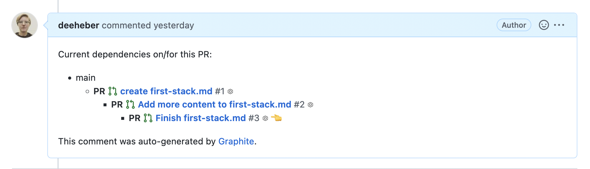

> Photo by <a href="https://unsplash.com/@richygreat?utm_source=unsplash&utm_medium=referral&utm_content=creditCopyText">Richy Great</a> on <a href="https://unsplash.com/s/photos/github?utm_source=unsplash&utm_medium=referral&utm_content=creditCopyText">Unsplash</a>

## Current Landscape

[Git](https://git-scm.com/) is a tool that many tech people use and it is great for the most part. Like many things, there are some pain points that could improve the experience. My issues revolve around when it comes to collaboration with others. Here's some examples.

As someone requesting a code review, so I can merge my changes:

- waiting for someone to review my code
- sometimes the code in the PR is needed for next steps

As someone doing code reviews for my teammates:

- with all of the notifications sometimes it can be unclear which PRs I need to review or re-review
- having to navigate very long PRs

## Solution

Upon joining my most recent company, my onboarding buddy told me about how they use [graphite](https://graphite.dev/).

Graphite utilizes something they call a "stack." What used to be one huge PR is now many branches that build off of each other with each branch being its own PR.



Sounds great as someone who has to review code, but as the code submitter I had some concerns about what happens when merging branches. Would I get lots of merge conflicts? So far while using graphite, the answer has been mostly no. Graphite has a cli command  that pulls down changes from the upstream and automatically rebases all affected branches.

```sh
gt repo sync --restack
```

A nice bonus is that this command also prompts to ask if you want to delete local branches that have been merged into the `main` branch.

Another benefit is that graphite has a nice web based UI where you can see which PRs need your input both as a PR submitter and reviewer.

## Summary

Despite all of the custom cli commands, graphite uses git under the hood. If you want to do something with vanilla git, graphite will pass that command through to git directly. One con to using graphite is that it just appears to work with Github (for now?). At the time of writing this, there's a waitlist to get on the app.

There's many more cli commands and features that I did not cover. Much like git, people have their preferred workflows and there's many more commands/options than one would use in their daily workflow.

Disclaimer that I was not paid nor asked to write this post. I personally found this tool helpful. Thought I'd share about how it's helped me with the intent that it might also help you.
