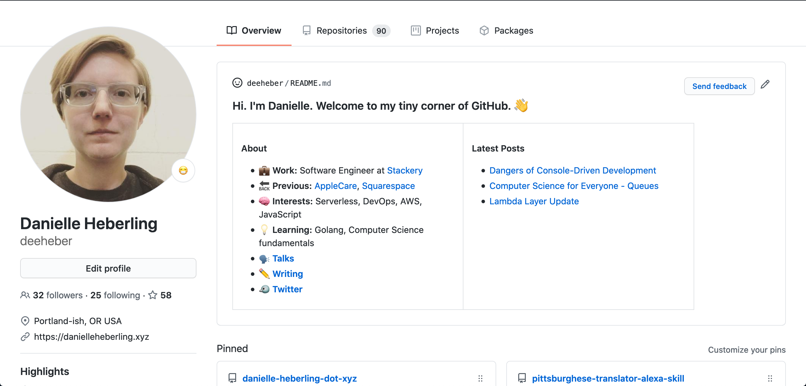

## The Project Idea
A few months ago, Github enabled the ability to add a README section to your profile in addition to the pinned repositories.

Personally, I find this pretty exciting. I'm sure many other software engineers can relate that we have some throw away projects and things that we built years ago on our profiles that don't fully reflect the big picture of our abilities or what we're currently into building. This gives us an extra place where we can highlight whatever we find important that we want to convey to people looking at our Github profile.

I decided to embark on the the journey of getting mine set up and wanted the following:
- Work information (past and present)
- Interests within the Software Engineering realm i.e. what languages, frameworks, etc I enjoy
- What I'm currently excited about learning
- Links to my website and twitter
- Showcase my three most recent blog posts

## Getting Started Building
Github makes this pretty easy to get set up...with that said, you can make this as hard or as easy as you choose. It is definately easy to add complication to make things challenging. 

The base idea is that you create a repository named the same as your username, add a `README.md`, and anything you put in that `README.md` file will be showcased on the main page of your profile for others to see. I got that part done pretty fast and added some emojis to make it fun.

## Going Beyond Markdown
I decided I didn't want to manually update my `README` file everytime I published a new post. I decided to automate it in order to ensure my three most recently published posts were showcased. Becuase I wanted a relatively lightweight solution that would be quick to implement, I decided to try out Github actions.

So the idea was to setup a job that runs once a day that does the following:
- Clones my repository code
- Sets up Node (my preferred language for this task)
- Runs a script that
  - Pulls down my three most recent post titles and links from my blog's rss feed
  - Replaces the links in the current README file with the new information
- If there are changes, push up the changes

## Setting up the Job
In my repo, I clicked actions and set up a new workflow. This consisted of adding a `.yml` file to `.github/workflow` in my `deeheber` repo. Github had tons of examples for me to take a look through and the syntax was quicker to pick up than say something like AWS CloudFormation.

In the end that file was pretty readible and looked like this

```yaml
name: Build README

on:
  workflow_dispatch:
  schedule:
  - cron: "30 15 * * *"

jobs:
  build:

    runs-on: ubuntu-latest

    steps:
    - name: Check out repo
      uses: actions/checkout@v2
    - name: Use Node
      uses: actions/setup-node@v1
      with:
        node-version: '12.x'
    - name: Install node dependencies
      run: npm install
    - name: Check for RSS feed updates
      run: npm run scrape
    - name: Commit and push if changed
      run: |-
        git diff
        git config --global user.email "actions@users.noreply.github.com"
        git config --global user.name "README-bot"
        git add -A
        git commit -m "Updated content" || exit 0
        git push
```

Even if you aren't familiar with the syntax, I think you can for the most part tell what each step is doing. This gets positive marks in my book. 

The `workflow_dispatch` event allowed me to go into the Github UI under actions and hit a button to manually run this job to test that things were working...this was super helpful in my development workflow.

Also since this action was setup under the README Github repo, I didn't need to worry about providing Github credentials to the job. It just worked ™️.

## Reflections
I am really impressed with how easy this was to get started and how quickly I was able to get something together and working. This also got me thinking that even though this is a super simple use case, that Github actions might be helpful for more complex cases and might reach for them in the future.

Here's how mine turned out



[Here's my code](https://github.com/deeheber/deeheber) if you want to take a look and try to build something similar yourself.

I'd encourage you to check this out. Even if you aren't in the DevOps yaml writing land like I am...I think Github has done a fantastic job with documentation to make this approachable for newcomers.