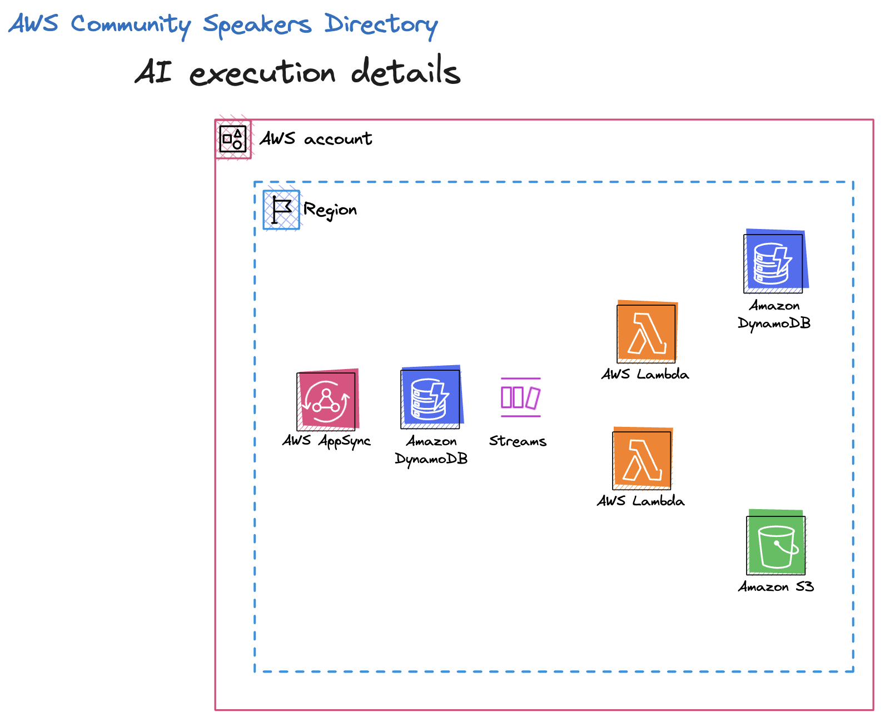

> Photo by <a href="https://unsplash.com/@8moments?utm_source=unsplash&utm_medium=referral&utm_content=creditCopyText">Simon Berger</a> on <a href="https://unsplash.com/s/photos/rainbow-mountain?utm_source=unsplash&utm_medium=referral&utm_content=creditCopyText">Unsplash</a>

## Background

In June 2023, [Johannes Koch](https://dev.to/lockhead), [Matt Morgan](https://dev.to/elthrasher), [Julian Michel](https://dev.to/jumic), and myself participated in the AI themed hackathon for the AWS Community Builders. The hackathon challenge was to create a tool using the [Transformer Tools](https://huggingface.co/docs/transformers/main/transformers_agents) framework.

## The Project

Johannes had the idea that we agreed to implement. We ended up building an AWS community focused [speaker directory website](https://speakers.awscommunitybuilders.org/#/). Think an awesome AWS focused version of [sessionize](https://sessionize.com/) where event organizers can create an event. Speakers can create a speaker profile and use the site to submit talks to the various events. For more details on the project, take a look at [Matt's overview post](https://dev.to/aws-builders/presenting-aws-speakers-directory-an-ai-hackathon-project-19je).

This post focuses on how we utilized the Hugging Face transformers agent to add functionality to our speaker directory.

Here's links to posts by my teammates on other topics related to the project

- [Overview](https://dev.to/aws-builders/presenting-aws-speakers-directory-an-ai-hackathon-project-19je)
- [How we used Amplify/Flutter](https://dev.to/aws-builders/amplify-sdk-for-flutter-developer-experience-and-challenges-in-a-hackathon-2e15)
- [How we used CodeCatalyst](https://dev.to/aws-builders/a-real-project-with-codecatalyst-our-hackathon-gave-us-a-good-insight-into-what-works-and-what-doesnt-1e79)
- [How we used AppSync merged APIs](https://dev.to/aws-builders/appsync-merged-api-our-real-project-experience-as-part-of-our-hackathon-2m96)

## AI Functionality

The AI functionality that we added to enhance the speaker directory was

1. Generate an image whenever a speaker adds a new talk
2. Generate appropriate tags and add tags to newly added talks
3. Allow event organizers to get recommendations of talks that fit their event based off of a set of tags

## Implementation Overview

### Architecture

Features #1 and #2 were set this up in a similar way. We have a DynamoDB (DDB) event source that triggers both Functions via a DDB stream whenever a new talk is added via an AppSync GraphQL (GQL) mutation. The two Functions then do the work of generating images and dynamically adding tags to the talk.

The final step of the tag generation Function (feature #2) is to insert the generated tags into our DDB table. We then have another DDB stream that triggers when a tag is inserted that then triggers a Function that does some aggregation for us to support feature #3.

For feature #3, we set up a GQL mutation that accepts an array of tags and queries our DDB table to retrieve a list of talks (recommendations) that also contain those tags.



### More on the Functions

Everyone on the team was new to the world of AI/ML, one thing we quickly realized was that these Functions were very heavy in terms of the size/number of dependencies needed and in terms of the compute power needed to complete these complex AI processing tasks.

Inspired by [this blog post](https://aws.amazon.com/blogs/compute/hosting-hugging-face-models-on-aws-lambda/), we decided to utilize an EFS file system to cache some artifacts to lessen cold start on subsequent requests to these AI processor Functions. Due to the number of dependencies needed, we decided to take advantage of packing our Function code using Docker containers instead of .zip files to take advantage of the [higher size limit](https://docs.aws.amazon.com/lambda/latest/dg/gettingstarted-limits.html).

Matt also learned that sometimes maintainers are not great at updating the dependencies in their Docker images, and he ended up creating a custom Docker image based off of the image used in that linked blog post with updated Python and gradio-tools (we needed it for image generation).

### Function code - Generate Image

This Function responds to the DDB insert event when a new talk is added, calls the Hugging Face agent to generate an image based off of the description of the talk, and puts the generated image into an S3 bucket.

The new part for us was working with the Hugging Face agent. We first needed to login using credentials stored in Secrets Manager and generate the image using stable diffusion/gradio tools.

```python
from gradio_tools import StableDiffusionPromptGeneratorTool
from huggingface_hub import login
import boto3
from transformers import HfAgent, Tool

gradio_tool = StableDiffusionPromptGeneratorTool()
tool = Tool.from_gradio(gradio_tool)
ssm = boto3.client("ssm")

agent_token = ssm.get_parameter(
    Name="/community-speakers/agent-token", WithDecryption=True
)
login(agent_token["Parameter"]["Value"])

agent = HfAgent(
    "https://api-inference.huggingface.co/models/bigcode/starcoder",
    additional_tools=[tool],
)
```

The entire Function code looked like this

```python
import boto3

import os
from gradio_tools import StableDiffusionPromptGeneratorTool
from huggingface_hub import login
from io import BytesIO
from transformers import HfAgent, Tool
import json

BUCKET_NAME = os.getenv("BUCKET_NAME")
gradio_tool = StableDiffusionPromptGeneratorTool()
s3 = boto3.resource("s3")
ssm = boto3.client("ssm")
tool = Tool.from_gradio(gradio_tool)

agent_token = ssm.get_parameter(
    Name="/community-speakers/agent-token", WithDecryption=True
)
login(agent_token["Parameter"]["Value"])
agent = HfAgent(
    "https://api-inference.huggingface.co/models/bigcode/starcoder",
    additional_tools=[tool],
)


def handler(event, context):
    print(json.dumps(event))

    image = event["Records"][0]["dynamodb"]["NewImage"]

    image = agent.run(
        "Generate an image of the `prompt` after improving it.",
        remote=True,
        prompt=f"{image['description']['S']} {image['title']['S']}",
    )
    buffer = BytesIO()

    image.to_raw().save(buffer, "png")
    buffer.seek(0)

    prefix = "ai-generated"
    newId = (
        event["Records"][0]["dynamodb"]["Keys"]["pk"]["S"]
        .replace("#", "")
        .replace(" ", "")
    )
    s3.Bucket(BUCKET_NAME).put_object(Body=buffer, Key=f"{prefix}/{str(newId)}.png")
    response = {"statusCode": 200, "body": "ok"}
    return response
```

### Function Code - Generate Tags

This function utilized a similar pattern in terms of connecting to Hugging Face; however, we utilized a different tools for this - the Bart model.

```python
import boto3
import os
from datetime import datetime
from transformers import pipeline

oracle = pipeline(model="facebook/bart-large-mnli")

tableName = os.getenv("TABLE_NAME")

client = boto3.client("dynamodb")


def handler(event, context):
    tags = get_tags()

    candidate_labels = [t["tagName"]["S"].lower() for t in tags]
    image = event["Records"][0]["dynamodb"]["NewImage"]

    # Use both the title and the description of the talk to identify tags
    identifiedTags = oracle(
        f'{image["title"]["S"].lower()} {image["description"]["S"].lower()}',
        candidate_labels=candidate_labels,
    )

    labels = identifiedTags["labels"]
    scores = identifiedTags["scores"]

    selectedTags = [t for index, t in enumerate(labels) if scores[index] > 0.3]

    save_tags(image, selectedTags)

    response = {"statusCode": 200, "body": identifiedTags}
    return response


# Query all tags to get a list of label candidates.
def get_tags():
    response = client.query(
        ExpressionAttributeNames={"#pk": "pk"},
        ExpressionAttributeValues={":tag": {"S": "tag"}},
        KeyConditionExpression="#pk = :tag",
        TableName=tableName,
    )

    tags = response["Items"]

    # Need the loop to get all tags.
    while "LastEvaluatedKey" in response:
        response = client.query(
            ExclusiveStartKey=response["LastEvaluatedKey"],
            ExpressionAttributeNames={"#pk": "pk"},
            ExpressionAttributeValues={":tag": {"S": "tag"}},
            KeyConditionExpression="#pk = :tag",
            TableName=tableName,
        )
        tags.update(response["Items"])

    return tags


# We're going to save any tags that the creator may have neglected to apply.
def save_tags(image, tags):
    tagList = list(set([t["S"] for t in image["tags"]["L"]] + tags))
    print(tagList)

    # Update the original talk with any new tags
    client.update_item(
        ExpressionAttributeNames={
            "#tags": "tags",
            "#_md": "_md",
        },
        ExpressionAttributeValues={
            ":tags": {"L": [{"S": t} for t in tagList]},
            ":_md": {"S": datetime.now().isoformat()},
        },
        Key={
            "pk": {"S": image["pk"]["S"]},
            "sk": {"S": image["sk"]["S"]},
        },
        UpdateExpression="SET #tags = :tags, #_md = :_md",
        TableName=tableName,
    )

    # Save any new tags
    for tag in tags:
        try:
            client.put_item(
                ConditionExpression="attribute_not_exists(pk) and attribute_not_exists(sk)",
                Item={
                    "pk": {"S": image["pk"]["S"]},
                    "sk": {"S": f"tag#{tag}"},
                    "gsi1pk": {"S": f"tag#{tag}"},
                    "gsi1sk": {"S": image["pk"]["S"]},
                    "tagName": {"S": tag},
                    "title": {"S": image["title"]["S"]},
                    "_et": {"S": "TAG"},
                    "_ct": {"S": datetime.now().isoformat()},
                    "_md": {"S": datetime.now().isoformat()},
                },
                TableName=tableName,
            )
        except client.exceptions.ConditionalCheckFailedException:
            print("Tag already existed!")
```

### Function Code - Aggregate Tags

This is triggered whenever a new tag is inserted into our table. As you'll see in the recommend talks Function, these aggregations support that feature. Because we don't need to utilize the Hugging Face transformers in this Function, we decided to do this one in Typescript rather than Python.

```typescript
import { UpdateCommand } from '@aws-sdk/lib-dynamodb';
import { type DynamoDBStreamEvent } from 'aws-lambda';

import { docClient, tableName } from '../util/docClient';

export const handler = async (event: DynamoDBStreamEvent): Promise<void> => {
  for (const record of event.Records) {
    const image = record.dynamodb?.NewImage;
    if (!image?.tagName.S) continue;

    const tagName = image.tagName.S;

    const command = new UpdateCommand({
      ExpressionAttributeNames: {
        '#quantity': 'quantity',
        '#tagName': 'tagName',
        '#_et': '_et',
        '#_ct': '_ct',
        '#_md': '_md',
      },
      ExpressionAttributeValues: {
        ':one': 1,
        ':tagName': tagName,
        ':timestamp': new Date().toISOString(),
        ':zero': 0,
        ':_et': 'TAG_COUNT',
      },
      Key: {
        pk: 'tag',
        sk: `tag#${tagName}`,
      },
      TableName: tableName,
      UpdateExpression: `SET #quantity = :one + if_not_exists(#quantity, :zero),
                             #tagName = :tagName,
                             #_et = :_et,
                             #_ct = if_not_exists(#_ct, :timestamp),
                             #_md = :timestamp
                         `,
    });

    await docClient.send(command);
  }
};
```

### Function Code - Recommend Talks

This Function is set up as a GQL resolver that is called from our Flutter frontend. We decided to set this one up as a Lambda resolver rather than a JS pipeline resolver because this feature is making multiple queries to our table. This Function also does not utilize the Hugging Face transformers, so we decided to write it using Typescript rather than Python.

```typescript
import { QueryCommand } from '@aws-sdk/lib-dynamodb';
import { type AppSyncResolverEvent } from 'aws-lambda';

import { type Event, type Talk } from '../API';
import { docClient, tableName } from '../util/docClient';

export const handler = async (event: AppSyncResolverEvent<{ event: Event }>): Promise<Talk[]> => {
  const eventTags = event.arguments.event.tags;
  const talks: Array<Talk & { matches?: number }> = [];
  for (const eventTag of eventTags) {
    const queryTagsCommand = new QueryCommand({
      ExpressionAttributeNames: {
        '#gsi1pk': 'gsi1pk',
      },
      ExpressionAttributeValues: {
        ':gsi1pk': `tag#${eventTag}`,
      },
      KeyConditionExpression: '#gsi1pk = :gsi1pk',
      IndexName: 'gsi1',
      TableName: tableName,
    });
    const tagsResult = await docClient.send(queryTagsCommand);
    if (!tagsResult.Items) continue;

    for (const tagResult of tagsResult.Items) {
      const queryTalksCommand = new QueryCommand({
        ExpressionAttributeNames: {
          '#pk': 'pk',
          '#sk': 'sk',
        },
        ExpressionAttributeValues: {
          ':pk': tagResult.gsi1sk,
          ':talk': 'talk',
        },
        KeyConditionExpression: '#pk = :pk and begins_with(#sk, :talk)',
        TableName: tableName,
      });
      const talksResult = await docClient.send(queryTalksCommand);
      if (talksResult.Items) {
        talksResult.Items.forEach((talk) => {
          if (!talks.find((t) => t.pk === talk.pk)) {
            talks.push(talk as Talk);
          }
        });
      }
    }
  }

  talks.forEach((talk) => {
    const matchCount = (talk.tags || []).filter((t) => eventTags.includes(t)).length;
    talk.matches = matchCount;
  });

  return talks
    .filter((t) => t.matches)
    .sort((a, b) => (a.matches && b.matches && a.matches < b.matches ? 1 : -1))
    .slice(0, 10);
};
```

## Trade offs

We noticed that generative AI takes a lot longer to process than your typical CRUD-like API against a database. For this reason a lot of our processing was conducted in an async manner. Not necessarily a trade off, but we did need to change our mental model in how we approached this as it was not going to be a good user experience if we stuck with the more traditional request/response model.

An issue that we ran into was that the shared AWS account we were using for the hackathon was considered "new" and had some additional usage limits on it. In our case, the Lambda Functions had an upper limit of `3008` mb. Most of the time, this is more than enough memory for a request/response API endpoint that interfaces with a database; however, with AI/ML having more memory would've helped with our slow responses during the processing.

We wrote a ticket to AWS support and were told that these limits are in place on newer accounts to prevent surprise bills. Then they told us they couldn't raise the limit until they saw more activity in the account. I can't speak for my teammates, but it is my personal hope that AWS can improve this process and live up to the "customer obsession" leadership principle. We ran into other issues with the "new" account limits, but that is the only one I'll mention here since it is directly related to our AI integrations.

### Post Hackathon Plans

Given the timeline for this hackathon (30 days) and the fact that no one on this team had extensive experience with AI/ML, we took some shortcuts when it came to the talk recommendations feature. Overall, I'm happy with how it came out. Post hackathon, we plan to explore creating and training our own custom data model based off of what was entered into our DDB table in order to see if we can further lean on AI/ML and get more specific (beyond tags) recommendations.

I would've liked to go beyond the Hugging Face transformers and see if some of this could be implemented using [SageMaker endpoints](https://docs.aws.amazon.com/sagemaker/latest/dg/realtime-endpoints.html) or another AI platform. Potential benefits that I saw with SageMaker endpoints over our implementation was that this is in the AWS ecosystem for a (hopefully) tighter integration and being able to speed up processing. I learned from this hackathon that Hugging Face is great, but there might also be other tools out there that better suit our needs. We won't know for sure until we try!

## Closing

Overall this was a fun collaboration. It feels good to contribute to building something that the community will use and to learn from my peers within the community while doing so.

On a personal level, life got in the way and I did not have as much time as I would've liked to have to dedicate to this project. I thank my team mates for their hard work via ideas and implementation. Major props to Matt for doing a lot of the AI implementation. 🙌🏻

If you would like to participate with us building out the [AWS Speaker Directory](https://speakers.awscommunitybuilders.org/#/) to help AWS User Group leaders find speakers, please reach out of any of us.
