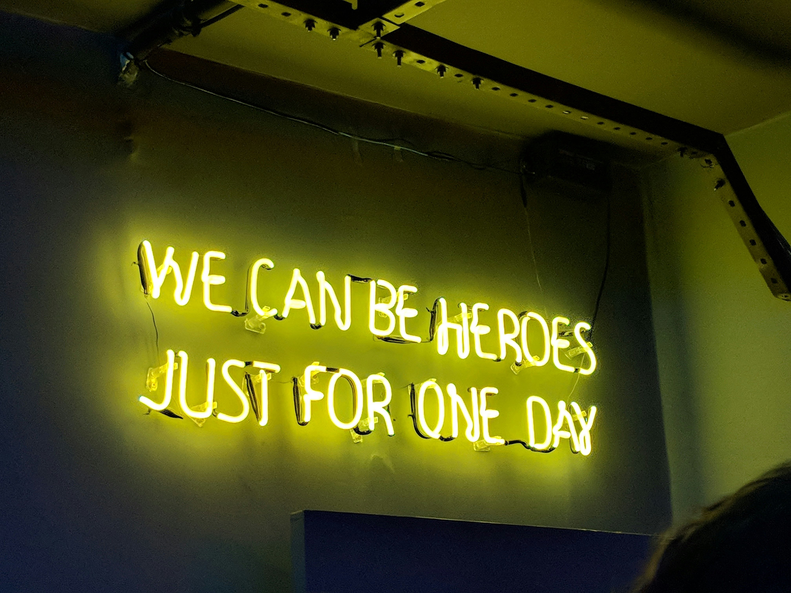

Photo by <a href="https://unsplash.com/@gabrielbassino?utm_content=creditCopyText&utm_medium=referral&utm_source=unsplash">Gabriel Bassino</a> on <a href="https://unsplash.com/photos/yellow-neon-light-signage-zEawlLdVloo?utm_content=creditCopyText&utm_medium=referral&utm_source=unsplash">Unsplash</a>

Lately, lots of folks have been asking how they can become an AWS Hero, so I decided it might be good to share my answer to that question publicly as a blog post.

**In my opinion, this is the wrong question to be asking.**

Personally, I never had the goal to become an AWS Hero. I did and will continue to do what I'm doing now with our without the AWS Hero title. I am very humbled and honored to have been recognized as one by AWS, but this is not why I do what I do.

In my opinion, the correct question to be asking is what are the rough edges and challenges in the current ecosystem and how can I share my knowledge and experience to make it easier for others?

For ideas and inspiration, I'd recommend looking at what current Heroes are doing, but also remember that you can always think outside of the box and do something completely new too.

Really looking forward to seeing what you create. It's always refreshing to see new perspectives from the community.

You don’t need permission or a fancy title to help others and make a difference. If you aren't sharing your knowledge and experiences publicly yet and want to, please join us! I'd love to hear your voice in the larger conversation.

> Disclaimer: This post reflects my personal opinions. It may be not reflective of the opinions of other AWS Heros or AWS.
