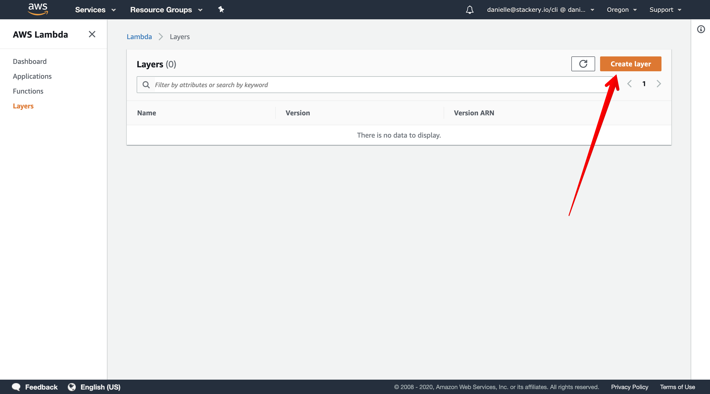
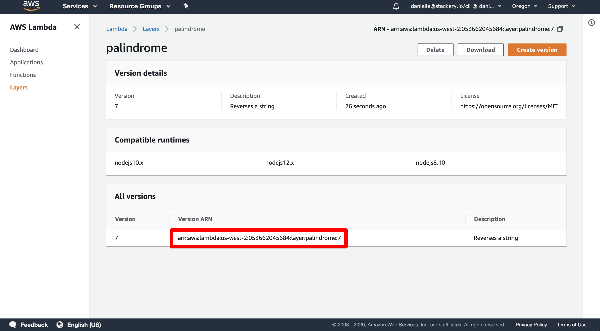
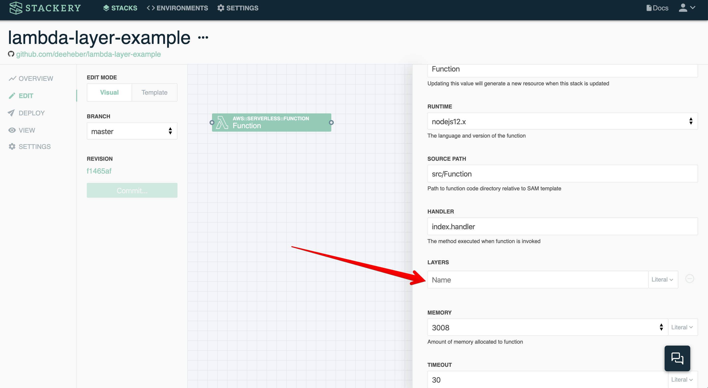

>Photo by Ivana Cajina on Unsplash

## The Problem
While speaking with folks who are new to serverless, I’m often asked “how can I reuse my code across multiple Lambda functions?” One way to do this is by writing your own custom Lambda Layer. In this post, we’re going to build a simple layer using nodeJS, deploy it, and use the layer in a function.

## What We’re Building
We’re going to write a lambda layer that contains a helper function. This function takes in a word or phrase and reverses the string. It’s not overly helpful in prod, but a simple example can be useful in seeing how things are setup.

## Write Lambda Layer Source Code
Create a new directory named palindrome. The file hierarchy will look like this.

```
palindrome
|_ nodejs
    |_ package.json
    |_ palindrome.js
```

The package.json will look like this

```
{
 "name": "palindrome",
 "version": "1.0.0"
}
```

The reverse.js file looks like this

```
module.exports = function (phrase) {
 return phrase.split('').reverse().join('');
};
```

Note that `palindrome` and `nodejs` are folders. The nodejs folder naming and placement is very important because it affects how the layer delivers the code to functions.


## Deploy the Layer
First we’ll need to zip up the layer in order to upload it to the AWS Lambda console.

You’ll want to `cd` into your `palindrome` folder via the terminal and run:

```
Zip -r palindrome.zip ./*
```

You should now see a .zip file added in the nodejs directory. This is the file we will upload via the AWS Lambda console.

```
palindrome
|_ nodejs
    |_ package.json
    |_ palindrome.js
|_ palindrome.zip
```

Login to the AWS console and head to Lambda > Layers > click to create a new layer



You can then find the layer ARN here...copy/paste this for use later.



If you prefer to use the AWS CLI instead of the console, you can also do that by following <a href="https://docs.aws.amazon.com/lambda/latest/dg/configuration-layers.html#configuration-layers-manage" target="_blank" target="_blank" rel="noopener noreferrer">these directions</a>.

<a href="https://docs.aws.amazon.com/AWSCloudFormation/latest/UserGuide/aws-resource-lambda-layerversion.html" target="_blank" target="_blank" rel="noopener noreferrer">Cloudformation</a> also offers the ability to set this up; however, be careful about creating the layer in the same stack that has dependencies on the layer. It’s my personal opinion that keeping dependencies in a separate repo/stack might be a better practice to imitate how npm and other package registries work.

## Create a Function that Uses that Layer

I personally like to use Stackery in order to add my resources since it adds all the necessary permissions and connection for me via a drag and drop interface, so these instructions will show how to do that. Keep in mind if you wish to set it up using another method, be sure to remember to add the <a href="https://docs.aws.amazon.com/lambda/latest/dg/configuration-layers.html#configuration-layers-permissions" target="_blank" target="_blank" rel="noopener noreferrer">correct permissions</a>.

Head over to the canvas and double click your function to open up this dialog. You’ll then want to paste your layer ARN here:



Note: you need to do this everytime you update the layer version.

Not overly necessary for this example, but if you have multiple environments that rely on different layers you can <a href="https://docs.stackery.io/docs/using-stackery/environments/#setting-configuration-store-values" target="_blank" target="_blank" rel="noopener noreferrer">setup a parameter</a> to reference this layer that will be dependent on which environment you’re deployed into.

Also keep in mind that as of my writing this, AWS has  a limit of 5  layers per function.

## Add code to the function

The code in your index.js should look like this:

```
const palindrome = require('/opt/nodejs/palindrome');

exports.handler = async (event, context) => {
 // Log the event argument for debugging and for use in local development.
 console.log(JSON.stringify(event, undefined, 2));

 const words = 'This string should be reversed';
 const response = palindrome(words);

 return {
   statusCode: 200,
   headers: {},
   response: JSON.stringify(response)
 };
};
```

The important thing to note here is the first line where we require from `/opt/nodejs`, otherwise you can use your library like you normally would when developing outside of Lambda.

Once deployed, go ahead and invoke the function. You should see the original string reversed in the function response.

Check out the full code example in <a href="https://github.com/deeheber/lambda-layer-example/tree/original-blog-post" target="_blank" target="_blank" rel="noopener noreferrer">this repo</a>.

All of the official documentation from AWS  about Lambda layers can be found <a href="https://docs.aws.amazon.com/lambda/latest/dg/configuration-layers.html" target="_blank" target="_blank" rel="noopener noreferrer">here</a>.
