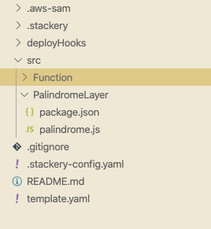

## Background
Earlier this year, I did a <a href="https://www.danielleheberling.xyz/blog/lambda-layer-example/" target="_blank" target="_blank" rel="noopener noreferrer">walk through demo</a> on how to use lambda layers with NodeJS. We build a helper function that takes in a string and returns the string backwards.

<a href="https://aws.amazon.com/blogs/compute/working-with-aws-lambda-and-lambda-layers-in-aws-sam/" target="_blank" target="_blank" rel="noopener noreferrer">Now that AWS SAM and the SAM CLI has support for building layers</a>, it's now easier to get this setup. The way in my prior post still works, but personally I recommend utilizing this method going forward.

## Setup
In this demo, I am going to use <a href="https://www.stackery.io/" target="_blank" target="_blank" rel="noopener noreferrer">Stackery</a>. Be sure to have the following installed in order to guarantee this will work.

- The lastest version of the SAM CLI
- The lastest version of the Stackery CLI
- Docker desktop (just needed for local invoke)

## Add Lambda Layer Resource
We start by adding a layer resource to the canvas in Stackery and connecting it to the function(s) that we'd like to use the layer. For readability, I renamed my Layer Resource Logicial Id to `PalindromeLayer`.


Make sure that your layer resource is referenced properly and that any old layers you're no longer using are removed. You can find this in the Function settings or in your template.


## Move Layer Source Code
Since the AWS SAM CLI can now build our layer for us, let's move the source code. Using my example, I moved my `package.json` and `palindrome.js` file into `src/PalindromeLayer`.



I then made sure my `ContentUri` correctly referenced this new location.


## Deploy the Layer and Locally Invoke
Once everything is deployed, I can now iterate locally on my function even if it has a layer. Since the Docker container used to build/include the layer in my function execution now needs to do the building, we need to add `--build` to the command.

Here's the command that I ran to test my function locally, keep in mind it might be a tad different than yours.

```
stackery local invoke -e development -f Function --build
```

## Additional
You can still deploy a Layer in another stack and reference it by ARN. Some organizations probably prefer this method, especially if that layer is being used by multiple functions in different stacks. To do this, set your `Build Method` to `none` in the layer settings and add the layer ARN in the function(s) settings that you'd like to use the layer.

## Closing
Personally I like this method better because it eliminate the manual process of zipping and uploading my Lambda Layer and then manually updating the layer version in my SAM template.

Check out the full code example in <a href="https://github.com/deeheber/lambda-layer-example/tree/layer-resource" target="_blank" target="_blank" rel="noopener noreferrer">this repo</a>.

All of the official documentation from AWS  about Lambda layers can be found <a href="https://docs.aws.amazon.com/lambda/latest/dg/configuration-layers.html" target="_blank" target="_blank" rel="noopener noreferrer">here</a>.
