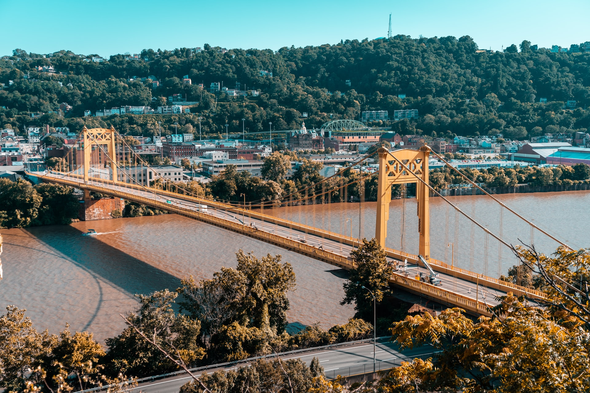
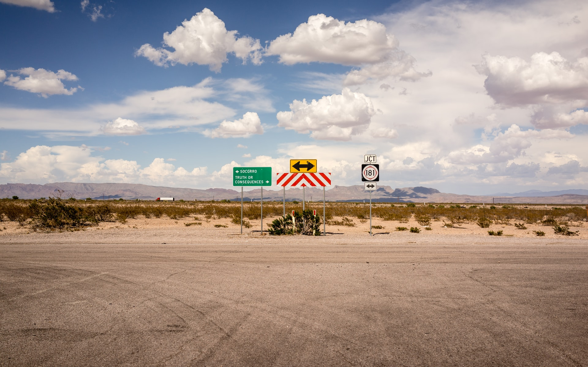

>Photo by <a href="https://unsplash.com/@cutnshoot?utm_source=unsplash&utm_medium=referral&utm_content=creditCopyText">Jonathan Rivera</a> on <a href="https://unsplash.com/s/photos/western-pennsylvania?utm_source=unsplash&utm_medium=referral&utm_content=creditCopyText">Unsplash</a>
  

I spent the first 22 years of my life in a part of the United States that many would call "flyover country." To most people this is an insignificant small town that peaked in the 1950s. As my father likes to say "This town was so much better when the mafia ran everything."

To me this town is a lot more... to me it is
- Where I was born and grew up
- Where my family is
- Where I first learned what community felt like
- Where I learned that I loved performing music
- Where I became the head drum major of my high school marching band

...in short, this town was home to me...

After high school graduction, I attended a state school in the area to earn a Bachelor Degree in Music Education. Taking a look around me, I noticed that teachers in local schools stayed in their positions for a long time. Upon graduation from university, I hit a crossroads where I had to choose between:
1. Substitute teaching for 10+ years until a teacher left their position
2. Moving somewhere else, getting some experience as a teacher, and moving back

>Photo by <a href="https://unsplash.com/@ivalex?utm_source=unsplash&utm_medium=referral&utm_content=creditCopyText">Ivan Aleksic</a> on <a href="https://unsplash.com/s/photos/crossroads?utm_source=unsplash&utm_medium=referral&utm_content=creditCopyText">Unsplash</a>

I chose option #2 in the end. Through many twists and turns, I am no longer a music teacher, nor have I moved back. Nowhere that I've lived since the initial move has felt like home.

Now we are in the midst of the Covid-19 global pandemic where many workers are forced to work remotely, some for the first time. Many companies have stated that they're planning on keeping employees fully remote for the forseeable future.

I take a look at my young neice whose bedroom is my childhood bedroom. The future of remote work gives me hope. Hope that my neice won't be forced into the same decision crossroad that I was. If she wants to move away, she still can...but with the increase of remote work it is less likely to be a decision that could impact how much money she can make or her career opportunities.

I don't regret the people and life experiences that I've had as a result of my choice. I do still wonder how much I've missed and ponder the possibility of an eventual return.

Afterall when we're gone, it doesn't matter what our rank was at our workplaces. It's the love we shared with the people around us. In the meantime, my neighbors will have to deal with my accent that slips out on ocassion.
