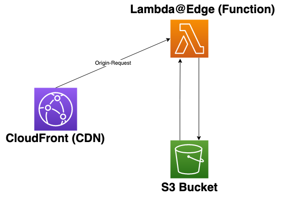

At [Koan](https://www.koan.co/?utm_campaign=edgerouter&utm_medium=blog&utm_source=medium), our application’s frontend is a [React](https://reactjs.org/) [Single Page Application](https://developer.mozilla.org/en-US/docs/Glossary/SPA) running in two distinct environments (Staging and Production).

In addition to viewing the Staging and Production versions of our frontend, we also need to serve up a version of the frontend based off of a git commit in our Staging environment. Doing this gives Koan developers a “live preview” URL to review what the frontend looks like after committing changes but before they’re merged.

### Our Solution

Our solution has the following high level steps:

1. Code changes are merged into our `main` branch. This action kicks off our [CI system](https://circleci.com/)
2. The CI builds the code and places the build artifacts (static HTML/JavaScript/CSS files) into S3 buckets
3. A CloudFront CDN is in front of one of those S3 buckets
4. Our staging app domain is pointed at this CloudFront CDN
5. On all origin requests to the staging app domain → a Lambda@Edge function serves a build-specific `index.html` with static references to the rest of the build



### More Details on Build Artifacts

Our CI process delivers build artifacts into S3 at `/commit/[commit sha]`.

When a developer wants to “live preview” their recent commit, they need to add `/commit/<their commit SHA>` to the end of our staging app domain.

Each `index.html` file in this S3 bucket references static assets (CSS/JS files) hosted on a separate `frontend-builds subdomain`. This domain pointed at a second CloudFront CDN with a second S3 bucket as its origin. Serving these as CDN-friendly, immutable assets saves significant compute (money) for resources that don't need Lambda@Edge.

### Inside the Lambda "router" function

Whenever that developer requests a specific version of the app, the request hits CloudFront as an `origin-request`. Our Lambda@Edge function receives a [message event](https://docs.amazonaws.cn/en_us/AmazonCloudFront/latest/DeveloperGuide/lambda-event-structure.html#example-origin-request) from CloudFront and then proceeds to do the following:

1. Gets the git commit hash from the pathname in the request. If there isn’t a commit hash in the URL, then we assume we want the latest version.
2. Gets the requested index file
3. Returns the index file as the body for our response

### Let's see some code

> Gets the git commit hash from the pathname in the request

Whenever someone makes an HTTP request to the CDN, the CDN then sends an event object to our Lambda@Edge function. The shape looks something like [this](https://docs.amazonaws.cn/en_us/AmazonCloudFront/latest/DeveloperGuide/lambda-event-structure.html#example-origin-request).

We then pull the `pathname` off of that event object:

```javascript
const url = require('url');

exports.handler = (event, ctx, cb) => {
  const { request } = event.Records[0].cf;
  const { uri } = request;
  const urlString = url.parse(uri);
  const { pathname } = urlString;

  // ...more code here
};
```

Now that we have our `pathname` (including the optional `commit/<commit sha>` fragment), we can extract our git commit hash by calling a `getHash` helper function.

If there isn’t a hash present in the `pathname` this means that we just want to serve up the latest version of the app, so we'll return `null`.

```javascript
const getHash = (pathname) => {
  const components = pathname.split('/').filter(Boolean);
  if (components[0] !== 'commit') {
    return null;
  }
  return components[1];
};
```

...

> Gets the requested index file

Now that we have our git commit hash (or the `null` default) from the `pathname`, let's pass that commit hash into another helper function to get the desired index file from our S3 bucket.

The variables that start with `process.env` are NodeJS's way of referencing environment variables on the Lambda function. We set these variables when the function was provisioned.

If the S3 object (index.html file) is missing, we handle that in the `catch` and log the error.

```javascript
const AWS = require('aws-sdk');

const s3 = new AWS.S3({
  apiVersion: '2006-03-01',
  region: 'us-west-2',
});

const getIndexFile = (hash) => {
  let key = `${process.env.ENV}.html`;
  if (hash) {
    key = `commit/${hash}/index.html`;
  }
  const params = {
    Bucket: process.env.BUCKET,
    Key: key,
  };
  return s3
    .getObject(params)
    .promise()
    .then((result) => {
      if (!result || !result.Body || !Buffer.isBuffer(result.Body)) {
        console.error('null data');
        return null;
      }
      return result.Body.toString('utf8');
    })
    .catch((err) => {
      console.error(err);
      return null;
    });
};
```

A possible next step to improve this might be using Lambda@Edge memory. Since the index file is immutable, we should only need to retrieve it from S3 once (or if Edge memory is dumped). https://aws.amazon.com/blogs/networking-and-content-delivery/leveraging-external-data-in-lambdaedge/

...

> Returns the index file as the body for our response

All together the function's code will look something like this

```javascript
const AWS = require('aws-sdk');
const url = require('url');

const s3 = new AWS.S3({
  apiVersion: '2006-03-01',
  region: 'us-west-2',
});

const RESPONSE_HEADERS = {
  // Add desired headers here
};

const getIndexFile = (hash) => {
  let key = `${process.env.ENV}.html`;
  if (hash) {
    key = `commit/${hash}/index.html`;
  }
  const params = {
    Bucket: process.env.BUCKET,
    Key: key,
  };
  return s3
    .getObject(params)
    .promise()
    .then((result) => {
      if (!result || !result.Body || !Buffer.isBuffer(result.Body)) {
        console.error('null data');
        return null;
      }
      return result.Body.toString('utf8');
    })
    .catch((err) => {
      console.error(err);
      return null;
    });
};

const getHash = (pathname) => {
  const components = pathname.split('/').filter(Boolean);
  if (components[0] !== 'commit') {
    return null;
  }
  return components[1];
};

// The main handler function code
exports.handler = (event, ctx, cb) => {
  const { request } = event.Records[0].cf;
  const { uri } = request;
  const urlString = url.parse(uri);
  const { pathname } = urlString;

  const hash = getHash(pathname);

  return getIndexFile(hash)
    .then((body) => {
      if (!body) {
        console.error(`could not find file: ${uri}`);
        cb(null, {
          status: '404',
          statusDescription: 'not found',
        });
        return;
      }
      cb(null, {
        status: '200',
        statusDescription: 'OK',
        headers: RESPONSE_HEADERS,
        body,
      });
    })
    .catch((err) => {
      console.error(err, `error with request uri: ${uri}`);
      cb(err);
    });
};
```

### Closing

While there are opportunities for improvement, this setup works well for our team, and we thought that sharing this approach might give you and your team some ideas to iterate on.

More recently, AWS released [CloudFront Functions](https://aws.amazon.com/blogs/aws/introducing-cloudfront-functions-run-your-code-at-the-edge-with-low-latency-at-any-scale/). Stay tuned as we evaluate if that’s a good solution for us to use instead of our existing Lambda@Edge functions. It’s highly possible we could re-architect this to completely bypass the S3 GET and/or further utilize the edge caching.

> Thanks to [Daniel Kaczmarczyk](https://dev.to/danielkaczmarczyk) and [RJ Zaworski](https://dev.to/rjz) for reviewing drafts of this article.

> Note: This post was originally published on the [Koan dev blog](https://medium.com/developing-koan/routing-on-the-edge-913eb00da742)
