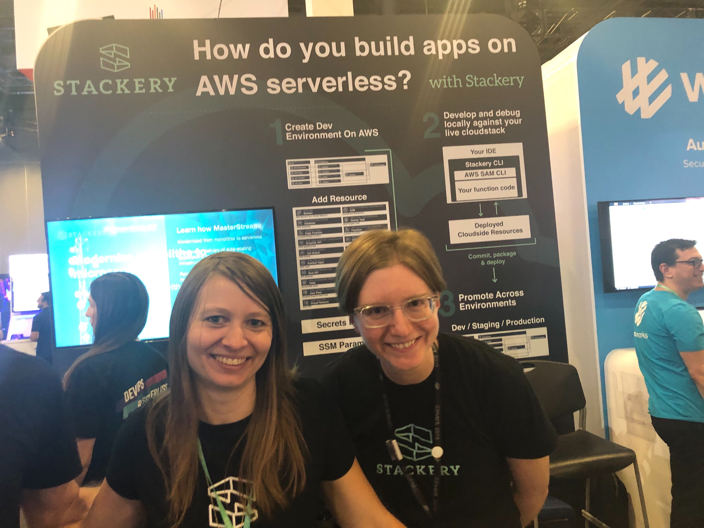
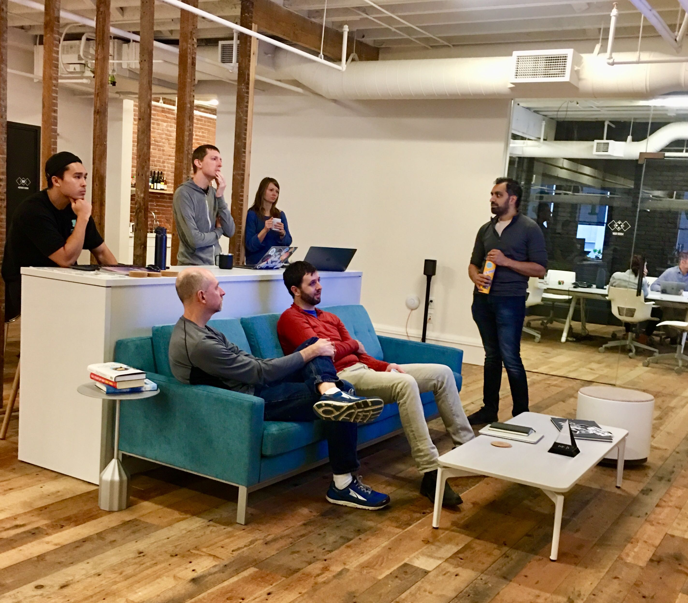
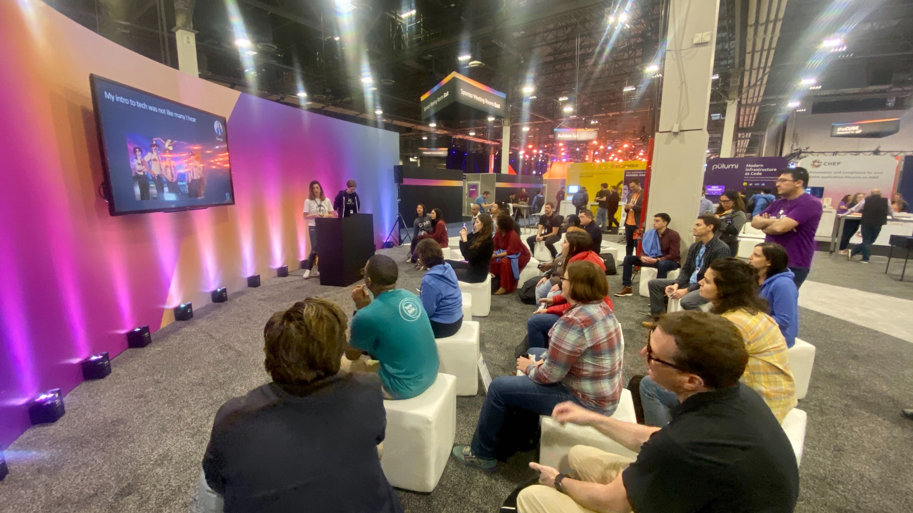

Serverless can bring opportunities by making DevOps more accessible to folks new to the industry. It can also bring opportunities to folks already in the industry that want to spend more time focusing on adding business value. But many technologists, seasoned or otherwise, hear a lot about serverless but don’t always know how to get started. As an early adopter of serverless, I am very interested in closing that gap by encouraging widespread adoption across all types of users and demographic groups. For me, this goal is a personal one.
Serverless IS for everyone, but the onus is on those already involved in the movement to make opportunities and resources more available — that means me! I want to share a bit about my story and goals with the hopes that it might a) inspire you to see how serverless can do the same for you and b) open up a conversation about how people like me can help others interested in serverless.

## How I Started

For those of you who don’t know me, a little introduction.

I began my adult career as a music teacher and then transitioned to tech support. Tech support was a wonderful experience because each day was a new challenge. Customers would write in with questions, bugs, and feature requests that would often require me to research their inquiry in order to fully address it.

After a few years of working in tech support, I noticed a pattern.

1. A customer would write in
2. I’d try my best to address their question/resolve their issue
3. Oftentimes, I’d be limited in how much I can help them out due to my role’s credentials and my experience-level
4. I’d escalate the issue to a software engineer that had the access and expertise to directly fix their issue and/or add their desired feature in the code.

Because I wanted to provide a higher level of support to customers, I decided I wanted to be that person who made the code change to directly address the customer’s inquiry vs just handing it off to another individual. I saw a need within my own day-to-day work and a clear way to address it.

For this reason, I quit my day job and attended a code school to become a software engineer.

## My Engineering Journey Begins

In code school, we spent a lot of time learning JavaScript. One thing that was lacking and became apparent whenever it came time to do our final group project was how to deploy the applications we were building. To be fair, the program was very fast-paced and it was impossible to cover everything, so in the meantime, my team used <a href="https://www.heroku.com/" target="_blank" rel="noopener noreferrer">Heroku</a> to deploy our final project. That worked well, but as an individual, I often found myself pondering how this would look with a production-level enterprise application. What’s the point of developing an application if you don’t know how to share it with the rest of the world?

Fast forward to my first job post-code school graduation. The team used Docker containers very heavily to deliver our application to the end-users. Since there were so many microservices and moving parts, we also used <a href="https://aws.amazon.com/ecs/" target="_blank" rel="noopener noreferrer">ECS</a> to handle the management of the container clusters.

On an individual level, I loved my job and really enjoyed writing code to solve problems. One thing that was necessary for my job was writing Dockerfiles and managing the various ECS clusters that were deployed on AWS. I wasn’t actually very interested in this part of the position but, since we were a small team, we had a weekly rotation where a different engineer every week was assigned deployment duty. Sometimes during deployment duty, I’d poke around AWS and see various managed services like SQS, SNS, Lambda etc. I had no idea then that my interest in wanting to know what these did would affect me down the line.

One day, my boss asked me to review a pull request in which he was experimenting with using a serverless architecture to create a chatbot. The idea was to experiment with a smaller tool used internally to see if this type of architecture might work for customer-facing production applications. I immediately had many questions and became hooked on this type of application building.

## Changes in Development Workflow and Minset Post-Serverless

Fast forward a few months. At this point, I was no longer focused on provisioning and managing Docker containers. Instead, I was utilizing managed services (in this case AWS) to do this work for me. Now that I had the extra mental bandwidth, I could spend time focusing on writing business logic. A mentor once told me that as a software engineer we’re paid to solve problems not to write code — and since I had begun to digest the concept of serverless, I had a better grasp on what that exactly meant.

Here’s a few highlights of things that noticed from a technical standpoint that needed to shift:

- Viewing logs in the cloud provider can be very helpful in troubleshooting code not working as expected.
- Local testing is possible with tooling, but it doesn’t completely replace deploying your application and testing it out in the cloud.
- Service limits are now tied directly to the managed services being used. Usually, these are very high limits. If you max out on a service limit, most cloud providers can raise the limit for you if you ask.
- Event-driven models and async workflows are more common.
- Deployment strategy / Environments / Infrastructure as code is more important than ever.

## What's Next for Serverless

Many people mark the start of serverless with the launch of AWS Lambda in late 2014. If you think about it, it really wasn’t that long ago. Serverless as a concept is still in its early stages, so is the community surrounding it.

I do a lot of time thinking about the serverless community, the degree to which it’s evolved in this short amount of time, and the direction I believe it should go in. It might sound like an oversimplification, but I believe the most important thing that we need to intentionally focus on in regards to evolving the serverless ecosystem is inclusion. We **must** do everything possible to attract folks from all backgrounds in order to make the community stronger and to build better applications that more accurately reflect the diverse user base we serve. It’s also crucial to continue asking what that looks like: _how_ do we speak to various individuals and groups? It’s not a static answer.

For now, I’ve come up with an answer in my own personal work and life: speaking to as many different groups in as many different locations as possible. Earlier in December, I spoke alongside Stackery’s Ecosystem’s Director, Farrah Campbell at <a href="https://www.stackery.io/blog/reinvent-danielle-talk/" target="_blank" rel="noopener noreferrer">AWS re:Invent in Las Vegas</a>.

This was an amazing and humbling opportunity that I’m still stoked about! But it’s no secret that not everybody is able to attend a huge and costly event like re:Invent for both logistical and financial reasons. So what other communities can I speak to and with?

## Serverless Days Nashville 🤠

Next up is Tennessee for <a href="https://serverlessnashville.io/" target="_blank" rel="noopener noreferrer">Serverless Days Nashville</a>. The topic? Encouraging people to take the first (or umpteenth) step in their serverless journey by using Stackery. If you can/will be in the area in February, I’d love to see you there. Want to connect about serverless and Stackery (or share any sweet tips about Nashville)? <a href="https://twitter.com/deeheber" target="_blank" rel="noopener noreferrer">Reach out to me on Twitter</a>.

> Note: This post was originally published on https://www.stackery.io/
