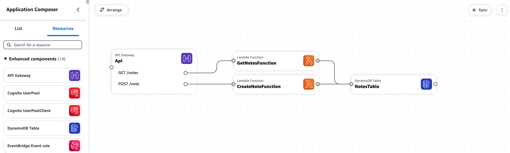
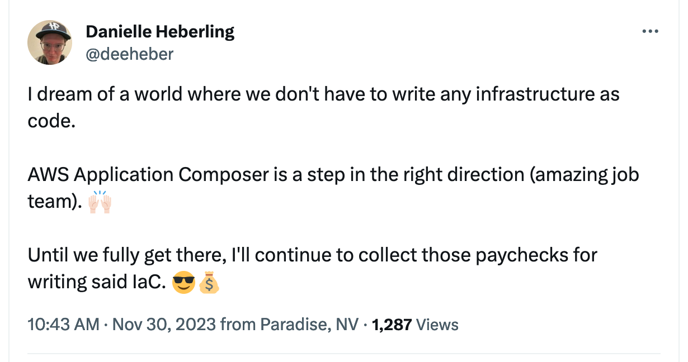
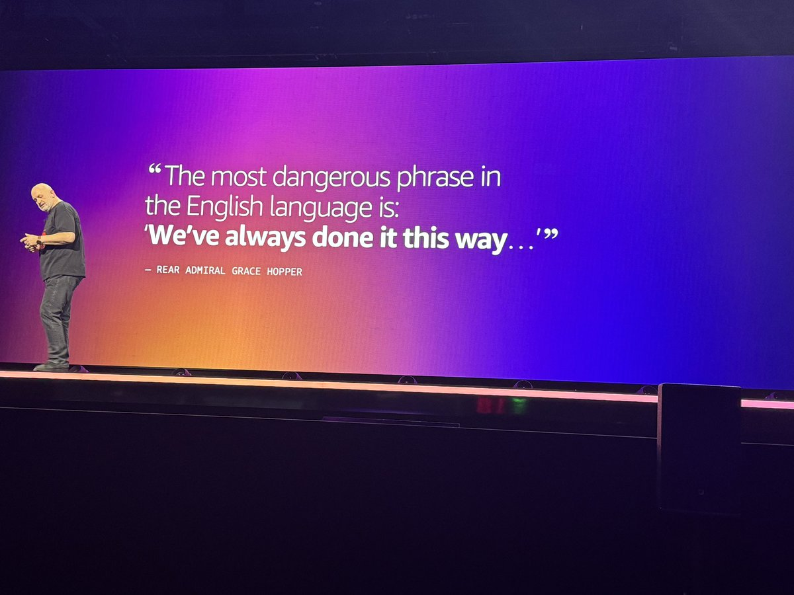
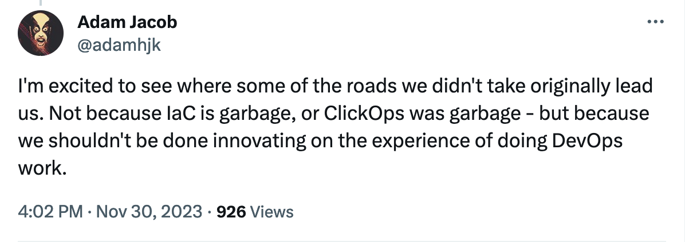

Originally, I wanted to blog about my favorite [re:Invent](https://reinvent.awsevents.com/) announcements. But as I started, I saw a higher level theme and decided to write on that instead.

_Disclaimer that this post contains my individual opinions and yours might differ. I welcome your polite/engaged feedback and encourage you to continue this conversation._

## Relevant Announcements

- [AWS Step Functions Workflow Studio is now available in AWS Application Composer](https://aws.amazon.com/blogs/aws/aws-step-functions-workflow-studio-is-now-available-in-aws-application-composer/)
- [AWS Application Composer IDE extension](https://aws.amazon.com/blogs/aws/ide-extension-for-aws-application-composer-enhances-visual-modern-applications-development-with-ai-generated-iac/)

## A Lightbulb Moment

My time spent as a software engineer at `$day_job` is mostly writing Infrastructure as Code (IaC). When reflecting on the [Serverless mindset](https://ben11kehoe.medium.com/serverless-is-a-state-of-mind-717ef2088b42), I believe that some aspects of this mindset conflict with how I spend most of my time at `$day_job`.

✅ _Pros of the status quo:_ writing IaC is repeatable, scalable, fun, and I'm good at it! 🙂

🚫 _Con of the status quo:_ I find myself wanting to spend more time focusing on providing business value and less time thinking about tooling or specific settings for my cloud resources.

Then a thought occurred to me: **What if we didn't have to write IaC? Why not have a deployable diagram of the application instead?**

This is where I think tools such as [AWS Application Composer](https://aws.amazon.com/application-composer/) and [AWS Step Functions Workflow Studio](https://docs.aws.amazon.com/step-functions/latest/dg/workflow-studio.html) are headed in a positive direction via their drag and drop visual interfaces.

## To a Brighter Future

[Werner Vogels](https://www.allthingsdistributed.com/about.html) said in his keynote that "the most dangerous phrase in the English language is: 'we've always done it this way'." I think this applies to how we've historically approached IaC with Serverless development.

Anecdotally, I've noticed that some experienced builders are ignoring updates to tools like this because they already know how to write IaC and think they don't need a visual interface. I politely disagree.

To me, being able to more quickly collaborate, share, and deploy cloud resources is a huge win for everyone, regardless of experience level or job title. The primary focus can then be providing business value rather than figuring out how to write IaC for a specific cloud resource.

We have so much more to offer than expertise in the tools that we use. Embrace the Serverless mindset and demand a brigher future. 😎

