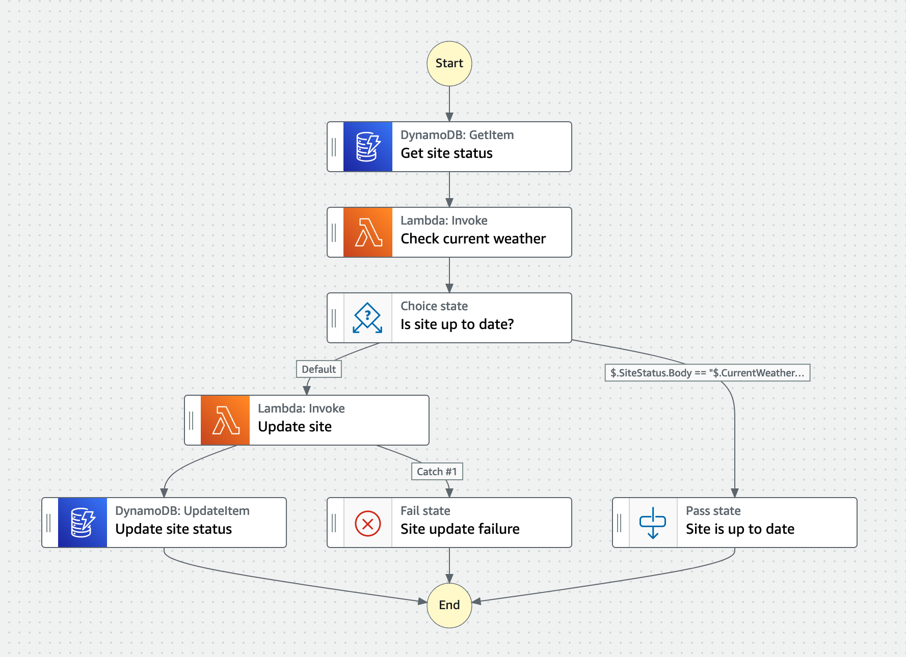

> Photo by <a href="https://unsplash.com/@devjustesen?utm_source=unsplash&utm_medium=referral&utm_content=creditCopyText">Devin Justesen</a> on <a href="https://unsplash.com/photos/QrL-aRyuf_8?utm_source=unsplash&utm_medium=referral&utm_content=creditCopyText">Unsplash</a>

## Background

I live in the [Pacific Northwest](https://en.wikipedia.org/wiki/Pacific_Northwest). Approximately 1-2 times per year, it snows. When this happens, people act shocked because "it never happens here."\* Our local governments do not have many snow plows nor do they salt the roads much. This means that when it snows, the roads are highly dangerous. The city of Portland, Oregon often shuts down for multiple days.

Former residents of Portland created a website, [isitsnowinginpdx.com](http://isitsnowinginpdx.com/). I cannot speak for their motivations, but I find this site both entertaining and informative.

After moving out of Portland into the suburbs, I noticed that the site was not as accurate, so I decided to build my own site [isitsnowinginhillsboro.com](http://isitsnowinginhillsboro.com/).

## Architecture Overview

Behind the scenes, this site is using AWS Serverless technologies. [S3](https://aws.amazon.com/s3/) hosts site assets, a [Step Function](https://aws.amazon.com/step-functions/) updates the site, and [EventBridge Scheduler](https://aws.amazon.com/eventbridge/scheduler/) triggers the Step Function every 10 minutes.

I made the decision to **not** put [CloudFront](https://aws.amazon.com/cloudfront/) in front of this S3 Bucket, because this is a region specific website. Most people viewing this site live in the area and adding a CDN feels like unnecessary complexity given the use case. As a result, the site renders of `HTTP` rather than `HTTPS`.

Here's a breakdown of what the Step Function workflow does:

1. Get the site's current status (`snow` or `no snow`) from a DynamoDB table
2. Check the current weather using the [OpenWeatherMap API](https://openweathermap.org/api) via a Lambda Function
3. A choice state compares the two values
4. If the two values match, nothing happens and the workflow ends
5. If the two values do not match, it updates the site to show the current weather obtained from the API
   - A Lambda Function generates the HTML and places that HTML file into an S3 bucket (more on this later)
   - If the Lambda Function is successful, then it updates the site status in DynamoDB

Here's a visual representation of the workflow:

## Challenges

Overall things went smoothly. I did run into a few tiny issues.

### Issue 1: EventBridge Scheduler and CDK

EventBridge Scheduler is a new-ish feature and does not have an L2 construct. I was able to implement what I needed for this site using an L1 construct, but with an L1 construct you're writing Cloudformation without the benefits that an L2 construct provides. In this case, I had to define an [IAM Role to allow the Scheduler to invoke the Step Function and an inline policy](https://github.com/deeheber/weather-site/blob/blog-post/lib/weather-site-stack.ts#L219-L237). This is likely a feature that would be included in an L2 construct.

More info on L1 vs L2 constructs [here](https://docs.aws.amazon.com/cdk/v2/guide/constructs.html#constructs_l1_using). I plan to keep an eye on this open [RFC](https://github.com/aws/aws-cdk-rfcs/issues/474).

### Issue 2: HTML Generation

Step Functions have [direct integrations](https://aws.amazon.com/about-aws/whats-new/2021/09/aws-step-functions-200-aws-sdk-integration/) with many services. The advantage of this is you do not have write a Lambda Function to make those AWS SDK calls and can save money as well as enjoy the built in error/retry logic that comes with the Step Function service. I used the direct integration for the two calls to DynamoDB and it worked quite well.

When it came to generating HTML and using the S3 PutObject, the direct integration added quotes around the HTML. This resulted in an HTML document that looked similar to `"<h1>My site<h1>"`. The extra quotation marks caused the page to not render properly in the browser. I eventually got this working with a Lambda Function by [sending the Body as a Buffer](https://github.com/deeheber/weather-site/blob/blog-post/src/functions/update-site.ts#L68), but I prefer the direct integration.

## Your Turn

The code is open source and you can view it [here](https://github.com/deeheber/weather-site/tree/main).

You can clone the repo following the instructions in the [README.md](https://github.com/deeheber/weather-site/blob/main/README.md) file to create your own weather site. Plug in the latitude and longitude of your city. Also, it's not limited to snow! Check out the `Main` weather types [here](https://openweathermap.org/weather-conditions#Weather-Condition-Codes-2) for all available options.

[Open source contributions are welcome](https://github.com/deeheber/weather-site/blob/main/CONTRIBUTING.md). Currently, [I'm seeking CSS help](https://github.com/deeheber/weather-site/issues/1).

Thanks to the original creators of [isitsnowinginpdx.com](http://isitsnowinginpdx.com/) for the inspiration.

\* To be fair the last instance of snow in the area was [more than usual](https://www.oregonlive.com/weather/2023/02/portland-records-snowiest-day-since-1943-landing-at-no-2-on-all-time-list.html).
