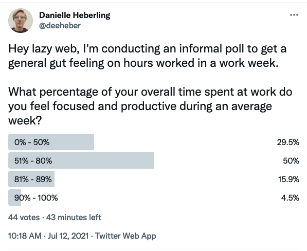

>Note: This post was originally published on the [Koan dev blog](https://dev.to/koan/the-secret-to-getting-more-done-5hjh)

It was a cold and rainy day as I sat alone in my home office debugging Webpack config errors. No matter what I tried, the errors would not go away. My natural inclination was to "just get through most of them" before eating lunch. But as I fixed errors, more emerged. Do you know what eventually got me through these hang ups?

## Taking a break.

As my hunger grew stronger, I decided to give in and went to lunch. Being able to step away and temporarily detach my mind from the task at hand was just what I needed to approach this problem with a fresh approach full of new things to try.

Time and time again, the act of taking a break has helped immensely both for getting meaningful work done and for my overall mental state.

Photo by <a href="https://unsplash.com/@sanderdalhuisen?utm_source=unsplash&utm_medium=referral&utm_content=creditCopyText">Sander Dalhuisen</a> on <a href="https://unsplash.com/s/photos/lunch?utm_source=unsplash&utm_medium=referral&utm_content=creditCopyText">Unsplash</a>

My top three activities while taking a break throughout the workday are:

1. Take a walk outside if weather isn't too bad.
2. Change my surroundings. This could mean working at nearby coffee shop or moving from a desk to a couch. The context switching required to get up and move also helps to refocus.
3. Read a book. Bonus points if it is a physical copy or on an e-reader. It's important to not stare at the same screen all day.

[Some companies](https://fortune.com/2021/07/06/kickstarter-four-day-work-week-2022/) are planning to take this idea a step further and are piloting a four day work week. Personally, I'm really interested to see how the rise of remote/hybrid workplaces as a result of the COVID-19 pandemic affects workers' break frequency. Curious to see if it goes up or down. In the meantime, I'm happy I get to work on a [team](https://www.koan.co/company/about) that facilitates working with purpose, built on a culture that supports transparency, autonomy and inclusivity.

**Four-day weeks and hybrid workplaces don't mean less work—just a more honest accounting of what already goes on.** The standard work week in the USA is currently 40 hours, but no one is actually productive that entire time. I set up a poll on Twitter to get some data points on this and here's the results.

Remembering to take breaks has helped me to get more done while working fewer hours, and I can support my teammates better by bringing my best self to my work. Maybe it can help you too. What are some of your favorite activities to do when taking a break during the work day?
