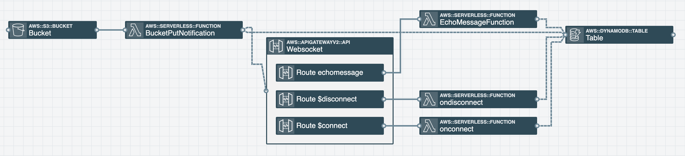

>Photo by Quino Al on Unsplash

## The Problem
I was working on a web application that allows users to upload plain text files and translate that text into another language (with the caveat that the inbound and outbound languages are supported by <a href="https://docs.aws.amazon.com/translate/latest/dg/what-is.html" target="_blank" rel="noopener noreferrer">AWS Translate</a>). The frontend talks to the backend via AWS API Gateway REST endpoints.

Everything was going well, until I started uploading longer text files to translate. Because of the larger file size, the backend took a while longer to process and I found my HTTP connection response was timing out before the translation was complete. Sure refreshing the webpage until the translation was complete is a solution that would work...but I wanted something a little more seamless. 

Enter websockets. Websockets allow for two way communication between clients (in this case my website in the browser) and a backend (in this case my AWS API, Lambda Functions and S3 Buckets). A popular use case for websockets is real time chat applications. Someone writes and sends a message and the message is received by everyone in that particular chat room.

In my particular use case, I wanted to send a request to start the translation from my client (the website) to my backend. Whenever the translation is ready, send a response to the client from the backend (it is ready when the translated file is put in an S3 Bucket). 

## Setting Up the Websocket API
Luckily Stackery offers the Websocket API Gateway <a href="https://docs.stackery.io/docs/api/nodes/WebSocketApi/" target="_blank" rel="noopener noreferrer">as a drag/drop resource</a> in the editor. So I started by doing this. The important thing for me to add was my routes. AWS has three reserved routes `$connect`, `$disconnect`, and `$default`. It’s up to you if you want to include them in your project or not. `$connect` is triggered when a client connects to the websocket API, `$disconnect` is triggered when a client disconnects, and `$default` is the route that requests fall back on if a request comes in that doesn’t match any of the routes. You can also add your own custom routes in addition to these three default ones.

The default route key selection mechanism is `$request.body.action`, so I decided to stick with that. This means that in the body of your requests, you need to include an “action” key that has a value of one of your routes in order to ensure your request gets sent to the desired route in your API. You can also include any other important key/value pairs that your system is expecting.  For example, I want to send some data to a route named "test", the body of my request would look something like this:

```json
{ “action”: test, “data”: “data I am sending” }
```

## Backend walkthrough
On the other end of each API Gateway route, I connected a Lambda Function. I set up my `$connect` route to store all client connection ids in a DynamoDB table and my `$disconnect` route to remove the connection id from the DynamoDB table when a client disconnects. This is a nice way of keeping track of who is all connected, especially if I want to broadcast changes to all or some of my clients.

Next I got to work on my `BucketPutNotification` Lambda Function. I first wired it up to be triggered on `s3:ObjectCreated:*` and `s3:ObjectRemoved:*` events.

This Lambda Function works like this:
  1.	Get information about item(s) placed or removed from the S3 Bucket from the event object passed into the function.
  2.	Get all connection ids from the DynamoDB table.
  3.	Send the S3 Bucket information to every client.

In order to send my notification from my Lambda Function to my client(s), I used the `postToConnection` method off of the <a href="https://docs.aws.amazon.com/AWSJavaScriptSDK/latest/AWS/ApiGatewayManagementApi.html#postToConnection-property" target="_blank" rel="noopener noreferrer">ApiGatewayManagementApi JavaScript class</a>.

Keep in mind that your Lambda Function must have `execute-api:ManageConnections` IAM permission in order to be able to do these types of sdk calls. It will also need to know your API connections endpoint as well as your client connection ids. One hiccup I had was neglecting to stringify the data I was sending. According to the documentation, the data being sent must be a string or buffer. I can tell you firsthand if you’re trying to send a JavaScript object, it won’t work.

<a href="https://www.npmjs.com/package/wscat" target="_blank" rel="noopener noreferrer">Wscat</a> was a tool suggested throughout the AWS docs in order to setup a client to test your websockets. I used this for testing purposes, but my end goal was not a CLI type of interface.

Here's what my backend ended up looking like from an architectural standpoint.


(click to expand image)

## Client (Frontend) Walkthrough
For this particular project my desired client was a website built using reactJS, so here’s how I went about getting that setup. 

I first grabbed my Websocket URL from the Stackery dashboard (can also get it from the AWS console) and used the browser <a href="https://developer.mozilla.org/en-US/docs/Web/API/WebSockets_API" target="_blank" rel="noopener noreferrer">Websocket API to connect</a> via `new WebSocket` on `ComponentDidMount`.

Once connected, my application listened for specific events `onopen`, `onmessage`, `onclose`, `onerror` in order to determine what type of action to take. These events (as well as others) are outlined in the <a href="https://developer.mozilla.org/en-US/docs/Web/API/WebSocket" target="_blank" rel="noopener noreferrer">Websocket API spec</a>.

If I want my frontend client to send a message to the backend, I can use the `send` method off of my connected WebSocket object. Then I’d include a JSON object that looks something like this:

```json
{ “action”: “echomessage”, “data”: “data I am sending” }
```

## Closing
We’ve only scratched the surface, but hopefully this post can give you some insight on how to setup websockets to talk to a web ui client via API Gateway websockets. If you’d like to see a working example of the infrastructure/code, I discussed in this post take a look at <a href="https://github.com/deeheber/websockets" target="_blank" rel="noopener noreferrer">this GitHub repo</a>.
