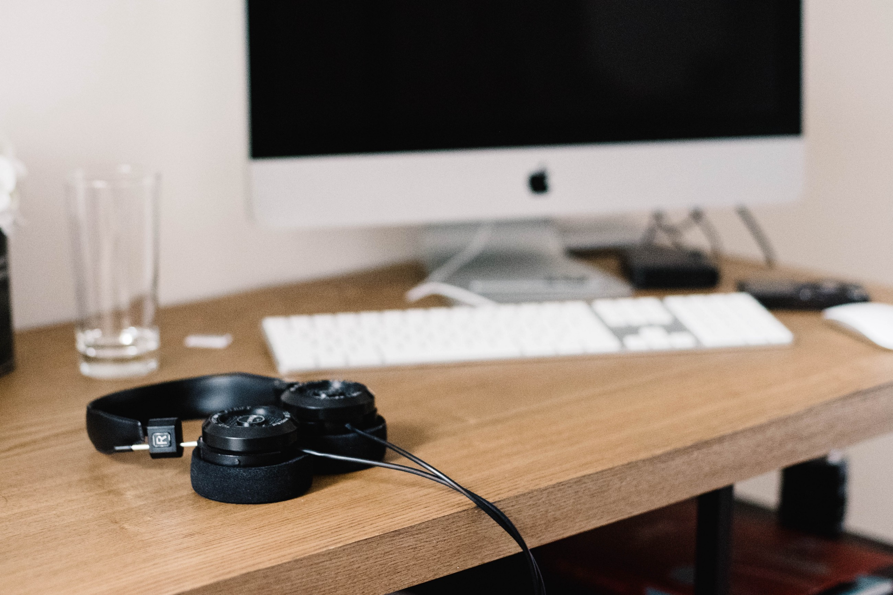

Oftentimes in society, we like to categorize things in two opposing binaries. Black and white. Dog people and cat people. Creative and logical. Artistic and mathematical. What about the gray area? What if something doesn’t fit neatly into this box or that box and instead loosely fits into both boxes?

I knew from a relatively young age that I wanted to be a musician. Music has always been a major influence in my life whether that be through my own medium of expression or through the inspiration that I receive from consuming music from other creators. What I didn’t know at that young age was that the skills that I learned as a musician though seemingly unrelated translate very well into other topic areas.

Since I made a career switch from being a music teacher to being a software engineer, here’s an overview of how the skills I learned as a musician have made me a better software engineer.

## Teamwork
Story time: when I was a music student in university there were two woodwind quintet groups. Group #1 was all of the individuals who were first chair in the entire university for their respective instrument. Group #2 (my group) were individuals that were good acquaintances and all in the same graduating class.

After a concert that showcased both groups, we all received feedback that group #2 outperformed group #1. The reason…well it wasn’t because each individual in the quintet was the “best” at our respective instrument…it was because we did a great job of collaborating with each other and blending to form a cohesive ensemble.

I feel this can also translate to a software team. Say for example you have a group of “rockstar” programmers…it doesn’t automatically mean that they as individuals are also great at collaborating or working on a team (disclaimer that some “rockstars” can). The best software teams that I have been on didn’t necessarily have the best individual programmers, but they were group of individuals that had a primary focus of helping each other out with the end goal of making the finished product better accompanied by a curiosity to learn something new.

## Practice
As a musician, I spent about 90% of my time practicing and 10% performing. Even more time was spent making my own oboe reeds…but that’s probably a separate blog post.

The same can be applied to software development. Currently as a professional software engineer, I spend the bulk of my time researching a new framework or technology, building throwaway apps, and reading documentation. The least amount of time spent is writing code that ends up getting shipped into production

## Attention to detail
In most academic settings a “B” grade is good enough to pass. Different institutions define a “B” differently; however, most places define is as 80–90% correct answers. Now think of that in terms of music…if I played a song with 90% of the notes being accurate…it would sound completely terrible.

The same principle applies to building software. How many times have you spent 30+ minutes trying to figure out why a linter was yelling at you…only to find you were missing a semi-colon or a closing curly brace? Near perfection is required.

## Learning a new language
When you think of a spoken language, there are always smaller building blocks that come together to build something larger. For example, a letter…becomes a word…becomes a sentence…becomes a paragraph…becomes a novel.

It’s similar in music. A note becomes a scale…sometimes multiple notes are played at the same time which creates a chord…multiple notes, scales, and chords come together to create a song.

In software development we have multiple programming languages and most languages have common building blocks that come together to create a script or software product. Those common building blocks include variables, functions, and conditional expressions.

## Context Switching
This next part is my personal opinion. As a musician I felt that the people that were the most fun to perform with were the folks who could just walk into a room and almost instantaneously fit in…both on a musicianship level and on a social skills level. I always enjoyed playing with the people that played multiple instruments and genres of music.

On the other hand, my favorite software engineers I’ve worked with are very good at reading the room and can adjust how they interact to fit the team’s preferred communication/working style. It has also been helpful (but not mandatory) to work with software engineers that know multiple programming languages and have worked on many different codebases of various sizes.

## Conclusion
If you’re already a software engineer and reading this; hopefully, you feel inspired to try performing or creating music. Not only is it a lot of fun, it will make you a better software engineer.

If you’re a musician, in Portland Oregon, and want to dabble with coding there are some free beginner learn how to code workshops on Meetup.

What are some other parallels that I might have missed? Also feel free to share how skills learned in other disciplines have helped you become a better software engineer and why in the comments.