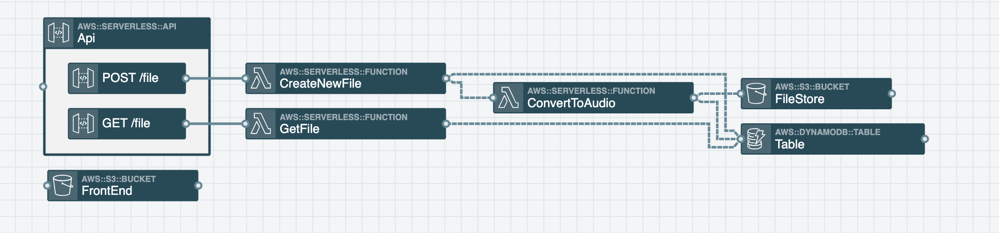

Recently, I spent some time building my own serverless text to speech converter and thought it might be helpful to share a bit about what I’ve learned during the process.

The Inspiration
I have been studying to take some AWS certification exams. One of the most helpful resources for me in preparing for those exams has been the <a href="https://acloud.guru/" target="_blank" rel="noopener noreferrer">A Cloud Guru</a> courses. One of the lessons was a lab in which you build your own text to speech converter in Python for the purposes of being able to review the notes that you’ve taken during the course via audio.

After following along with the lab, I wondered what that application would look like if it were built using <a href="https://www.stackery.io/" target="_blank" rel="noopener noreferrer">Stackery</a> and NodeJS...so I decided to try it out on my own. Because I take a lot of public transit, I figured this application would be useful to take my notes in text form and convert into mp3 files that can be listened to while on the go.

## The Architecture
I began by thinking through all of the high level steps and added/connected the resources in Stackery. There were a few iterations and many different ways to go about building this, but here’s the architecture I eventually settled on.

We have two API gateway endpoints: one to upload the text and convert it to an audio file and a second one to retrieve the metadata (including the s3 url) for each audio file.

The POST endpoint does the following:
An API Gateway endpoint invokes the CreateNewFile Lambda function
The CreateNewFile Lambda function adds metadata to a DynamoDB table and then hands the metadata info to the ConvertToAudio Lambda function
The ConvertToAudio Lambda function separates the input text into batches of 2500-ish characters each (this is due to Polly size limits more detail can be found in the Future Improvements section of this post). Then for each batch it calls Polly to convert the text to audio and places the resulting audio stream in the `/tmp` directory for temporary storage. Once all batches are processed, the contents of /tmp are uploaded to s3 and the s3 url is added to the dynamoDB table.

## Resource Permissions
Whenever you connect a resource (in this case Lambda functions) to a DynamoDB table or to an s3 bucket in Stackery visual mode, Stackery will grant that resource CRUD access to the target resource (in this case a DynamoDB table or an s3 bucket) since that is what most folks need. I enjoyed that setup for development purposes, but once the application was nearly complete, I only wanted to give my Lambda functions permissions to the actions they needed for security purposes.

So for example, my GetFile function allowed DynamoDB CRUD, but I just wanted it to have Scan and GetItem permissions to the table. Luckily with Stackery, I could use the template view to customize this beyond the default values. <a href="https://github.com/deeheber/text-to-speech-converter/blob/blog-post/template.yaml#L59" rel="noopener noreferrer" target="_blank">Here’s</a> what the end result looked like.

Another thing to note is if you want to give a function access to an entire bucket make sure you tack on `/*` to the end of the resource’s arn. It’s relatively simple to tack that onto the end of the resource’s arn via <a href="https://docs.aws.amazon.com/AWSCloudFormation/latest/UserGuide/intrinsic-function-reference-join.html" rel="noopener noreferrer" target="_blank">CloudFormation’s join</a>. <a href="https://github.com/deeheber/text-to-speech-converter/blob/blog-post/template.yaml#L104" rel="noopener noreferrer" target="_blank">Here’s</a> an example of what that looks like.

Finally security wise, since Stackery doesn’t have a built in Polly resource (because Polly is not supported by CloudFormation), I also had to make sure I added permissions from my Lambda function to Polly like <a href="https://github.com/deeheber/text-to-speech-converter/blob/master/template.yaml#L119" rel="noopener noreferrer" target="_blank">this</a>.

## Future Improvements
I view every one of my projects as a living breathing entity that is always growing and never fully complete, so here are some improvements I’d like to make as this application evolves. Most improvements are centered around how to better optimize the application in the case where I’d want to convert a massive amount of text (like an entire book) into an audio file.

Polly’s synthesizeSpeech API has a <a href="https://docs.aws.amazon.com/polly/latest/dg/limits.html" rel="noopener noreferrer" target="_blank">limit</a>. For now, I’ve built the app in a way where the input text gets chunked into blobs of about 2,500-ish characters then the program loops through each blob in order to call synthesizeSpeech for each blob to accommodate this limit. I may want to look into using the <a href="https://docs.aws.amazon.com/polly/latest/dg/asynchronous.html" rel="noopener noreferrer" target="_blank">SpeechSynthesis task API</a> instead.

It doesn’t affect smaller jobs or periodic blobs of notes, but if I want to scale  this to accept an entire book of text there is a DynamoDB <a href="https://docs.aws.amazon.com/amazondynamodb/latest/developerguide/Limits.html" rel="noopener noreferrer" target="_blank">max item size limit</a> that might wreak havoc in the way the system is currently set up. I currently have it set to write all of the data including the entire text to be converted to audio to the DynamoDB table, I may want to truncate the amount of text that gets written to the metadata.

Again much like the Dynamo limit, there are also some <a href="https://docs.aws.amazon.com/lambda/latest/dg/limits.html" rel="noopener noreferrer" target="_blank">Lambda limits</a> that I may bump up against if I use this program to process an entire book of text. Notably, the storage size of the `/tmp` folder and the invocation payload limit since we’re using a Lambda to invoke another Lambda by <a href="https://github.com/deeheber/text-to-speech-converter/blob/blog-post/src/CreateNewFile/index.js#L45" rel="noopener noreferrer" target="_blank">sending over the needed data via the payload</a>. I may want to re-architect this in a way where we’re utilizing a queue to send that info over from one function to the other or possibly even combine the two functions into one. Not overly sure of a nice solution to the `/tmp` storage size issue at this moment, but I’ll get back to you on that.

Unrelated to scaling to allow for larger file processing, I’d like to build a frontend for this application along with a login/auth. For simplicity sake, I temporarily added the `public-read` ACL to the audio files that are uploaded to the FileStore s3 bucket. That would be a serious issue, if we wanted to ensure those files weren’t accessible to the public. For studying purposes, I don’t really mind, so this setup works for this particular use case.
Closing
This was a really fun and useful project, not only with getting the hands on experience exploring an AWS service that is new to me...but also by building something meaningful that I can use to continue to improve myself via studying for my AWS certification exams while on the go.

The full repository can be found <a href="https://github.com/deeheber/text-to-speech-converter" rel="noopener noreferrer" target="_blank">here</a>. Hope it helps inspire you to go out and build something that is both fun and meaningful.

